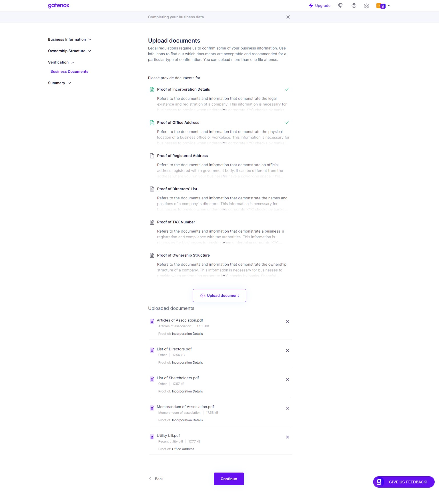

# Business Documents

The "Business Documents" screen contains a list of required proof of documents, which includes for example: Proof of Directors' List, Proof of Incorporation Details, and Proof of Office Address.


The required list of proofs may differ from those displayed below. The specific fields required by the company you are onboarding with depend on their specific data needs.


Users can upload the document by clicking on the "Upload Document" button, which will display a pop-up screen for the user to select the file they want to upload. After selecting the file, users need to choose the document type and select what the document is proof of. The list of values that users can select from includes Proof of Incorporation Details, Proof of Office Address, Proof of Registered Address, Proof of Personal Document, Proof of Residence Address, Proof of Directors' List, Proof of TAX Number, and Proof of Ownership Structure.

<figure><figcaption>
Business Documents
</figcaption></figure>

Once uploaded, a list of the uploaded documents will be displayed on the screen. Users can view the details of each uploaded document and also have the option to delete the document if necessary. It is important to ensure that the uploaded documents are clear and legible, as they will be used for verification purposes.
