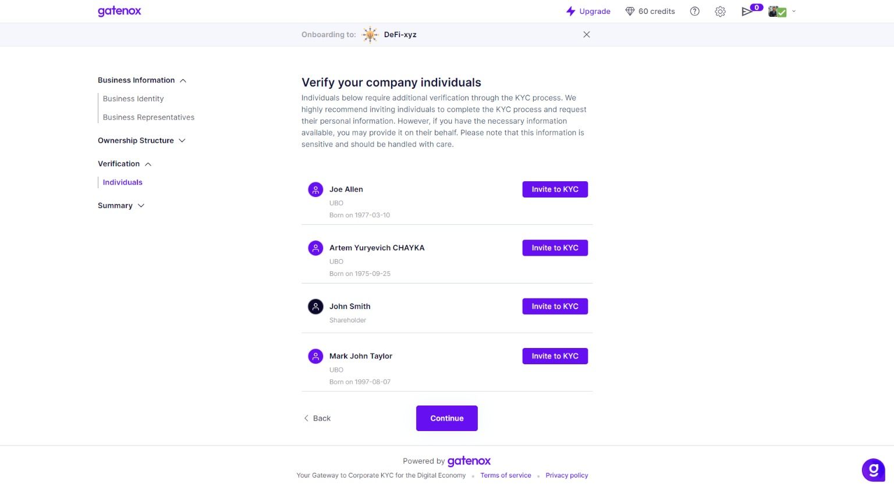
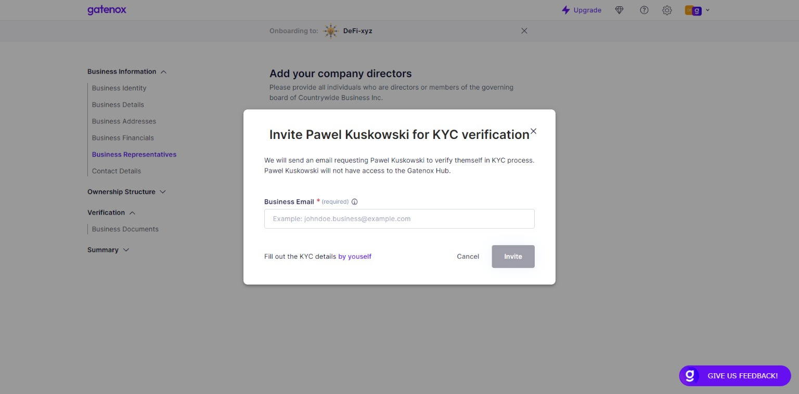
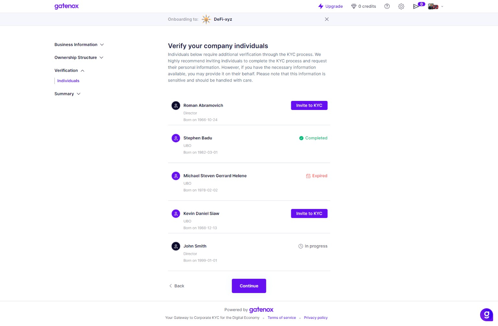
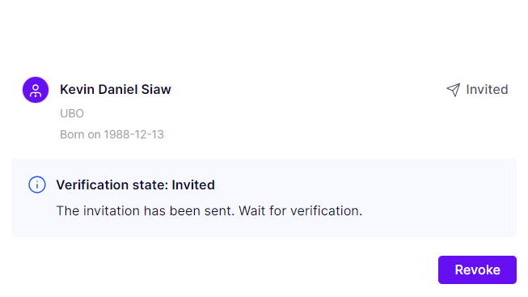
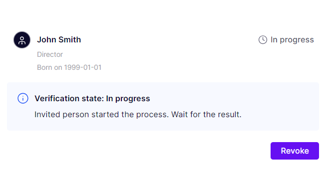
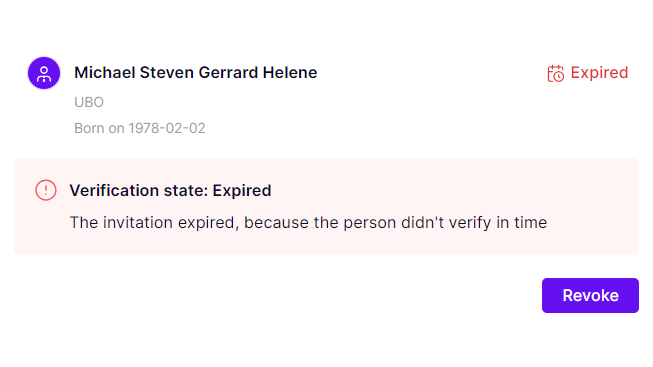
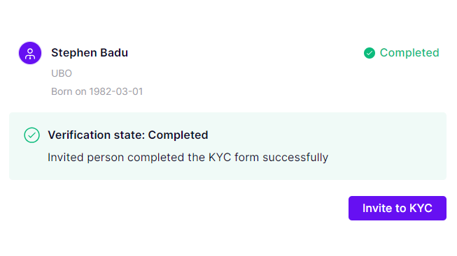
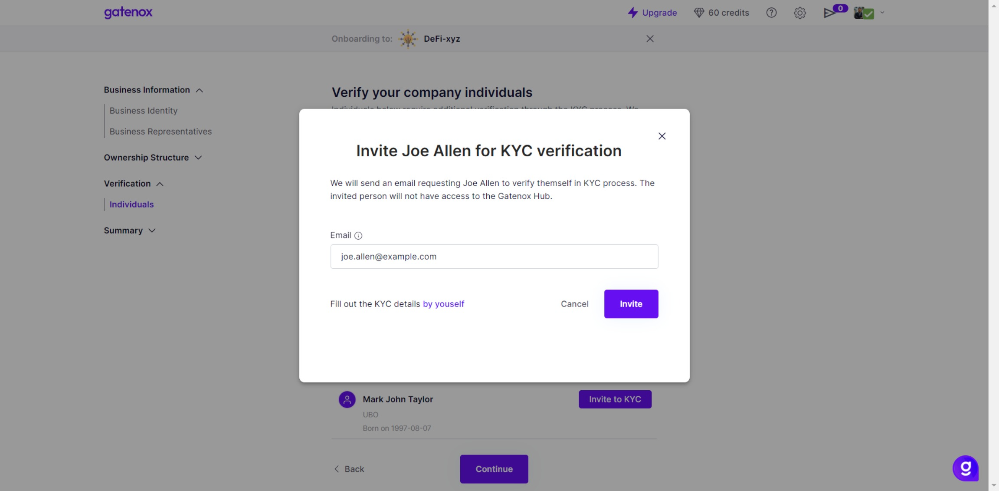
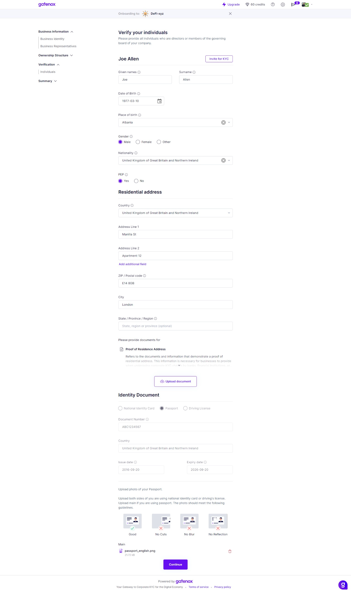
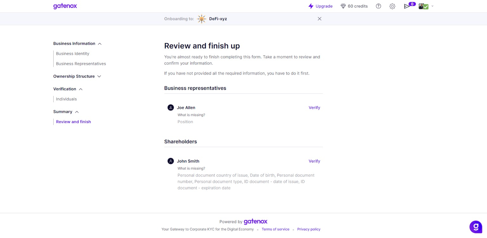

# Individuals

The "Individuals" screen allows Business Owners to manage individuals' data attached to the company profile. The list of individuals shows the surname and given names along with the individual's role in the organization and birth data.

The Gatenox Hub offers 2 ways of collecting individual identity data:

1. Data can be completed by the business user creating or managing the company's profile. In this scenario, the business user needs to be in possession of all required identity data and photos of identity documents belonging to directors/shareholders/UBOs added to the company's structure. More information here: [complete-kyc-details.md](../../kyc-process/complete-kyc-details.md "mention").
2. Send an invitation to the individual who has been added to the company's structure to complete the data. This scenario offers the business user the option of inviting the individual to complete the identity data and upload document photos on their own. Learn more here: [invite-for-kyc.md](invite-for-kyc.md "mention")

<figure><figcaption>
List of individuals
</figcaption></figure>

### Invite for KYC

If you are not in possession of director/shareholder/UBO identity data, you can simply send an invitation for KYC to this person.

The person will receive an invitation email and can follow the steps described here: [invitation-for-kyc.md](../../i-received-email-from-gatenox/invitation-for-kyc.md "mention").

Meanwhile, you can monitor their process on your side. The invitations can have different statuses.

#### Send the invitation for KYC

To send an invitation, click on the "Invite to KYC" link next to the individual's name. The popup window will be displayed.

<figure><figcaption>
Invite for KYC - send invitation to email address
</figcaption></figure>

Please enter the individual's email address and press the "Invite" button to send the invitation email to your director.

<figure><figcaption>
Individual's KYC invitation statuses
</figcaption></figure>

#### Invited

This is the first status after sending the invitation. It means that the invitation was sent but not opened.&#x20;

In this status, you are not able to enter any individual's data into Gatenox Hub. You can revoke the invitation and add data using the menu next to the individual's name. The invitation will be revoked and you can follow the process described here: [complete-kyc-details.md](../../kyc-process/complete-kyc-details.md "mention").

<figure><figcaption>
KYC status - not opened, actions
</figcaption></figure>

#### In progress

If the invitation is opened the status will change to "In progress".

In this status, you are not able to enter any individual's data into Gatenox Hub. You can revoke the invitation and add data using the menu next to the individual's name. The invitation will be revoked and you can follow the process described here: [complete-kyc-details.md](../../kyc-process/complete-kyc-details.md "mention").

<figure><figcaption>
KYC status - in progress, actions
</figcaption></figure>

#### Expired

The invitation is active for a limited time only. If the time expires, the invitation will change status to "Expired.

In this status, you are not able to enter any individual's data to Gatenox Hub. You can revoke the invitation and add data using the menu next to the individual's name. The invitation will be revoked and you can follow the process described here: [complete-kyc-details.md](../../kyc-process/complete-kyc-details.md "mention").

Alternatively, you can resend the invitation and allow the individual to complete the profile on his own. The invitation will change status to "Not opened".

<figure><figcaption>
KYC status - expired, actions
</figcaption></figure>

#### Completed

This status means that the individual has entered all required information. If any data is missing or requires to be corrected you can resend the invitation.

<figure><figcaption>
KYC status - completed
</figcaption></figure>

### Complete KYC details by yourself

If you own individual identity data, the quickest way to complete the profile is to add it on your own.

To do it, instead of inviting someone to the KYC process click on "Fill out the KYC details by yourself".

<figure><figcaption>
Invitation to KYC
</figcaption></figure>

Below you can find an example of completing individual data. The same screens will be presented in case of individual shareholders or UBOs. The data presented on the screen may be different - it depends on the verifier requirements.

<figure><figcaption>
KYC details - complete by yourself 
</figcaption></figure>


Required data! Please keep in mind that not all data shown on the screen might be required.&#x20;


The required data for individual verification can be found on the "Review and Finish" screen.

<figure><figcaption></figcaption></figure>
