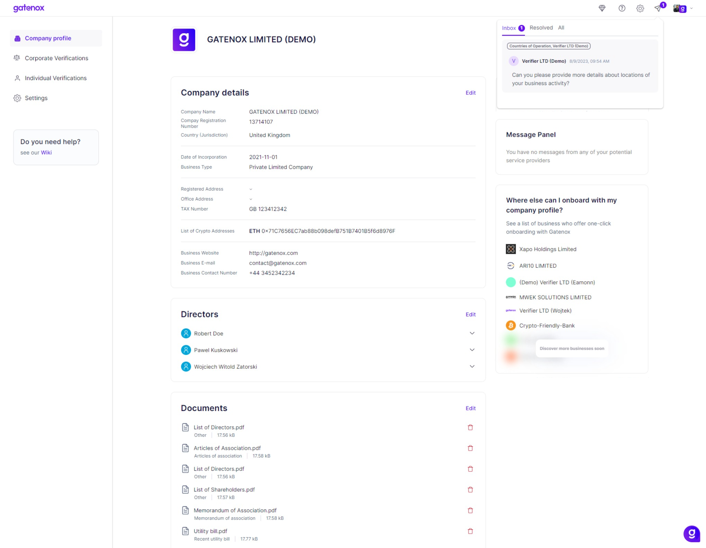
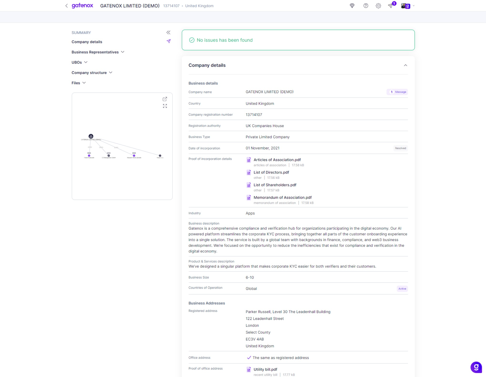
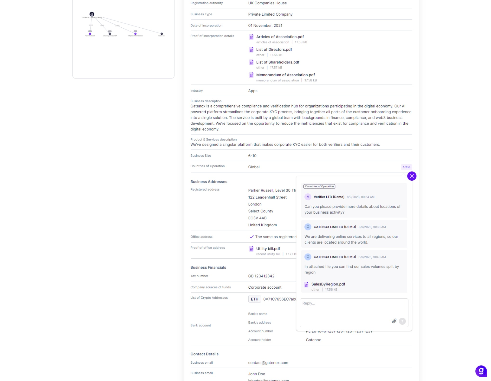

# I received a message from Compliance Officer

In Gatenox Hub, we provide a seamless and efficient in-app communication tool designed to facilitate smooth interactions between Users and Compliance Officers. This tool operates through the notification center and ensures effective communication throughout the onboarding process.&#x20;

Below is a comprehensive guide to help you navigate and make the most of this feature.

<figure><figcaption>
In-app communication tool - new message from Compliance Officer
</figcaption></figure>

### Key Features of the in-app communication tool

Here are key features of the in-app communication tool:

* **Receive Notifications and Questions:** Users can receive notifications and questions from Compliance Officers directly through the notification center. These notifications will pertain to specific data provided during the onboarding process.
* **Interactive Redirection:** Clicking on a notification will redirect users to the relevant application form. This form, however, offers a distinct view designed for effective communication between Users and Compliance Officers.
* **Uniform View:** The application form's view is adjusted to provide both Users and Compliance Officers with a consistent interface. This alignment ensures clear and mutual understanding of the discussions.
* **Status Labels:** Each field on the application view is accompanied by status labels, including:
  * **Unread Messages:** If there are unread messages, the label will indicate the number of unread messages. For instance, "(2) Messages",
  * **Active Conversation:** If there's an ongoing conversation without unread messages, the label will show "Active",
  * **Resolved Topic:** For topics that have been successfully resolved, the label will display "Resolved".

<figure><figcaption>
In-app communication tool - messages statuses
</figcaption></figure>

### **Engaging in Conversations**

Within the conversation window, Users can effectively engage in discussions with Compliance Officers. Here's what you can do:

* **Read Questions:** Users can read the questions or notifications provided by Compliance Officers. These questions will be related to the data submitted during the onboarding process.
* **Provide Answers:** Users can respond to questions by providing accurate and relevant answers. This facilitates clear communication and helps in resolving any queries.
* **File Attachments:** If requested by Compliance Officers, users can attach files directly within the conversation. This feature allows for seamless exchange of necessary documents or information.

<figure><figcaption>
In-app communication tool - User provides answer and attaches file
</figcaption></figure>

The in-app communication tool is a valuable resource that ensures efficient communication and collaboration between users and Compliance Officers. It streamlines the onboarding process by enabling clear and concise discussions, leading to accurate data submission and successful onboarding.
