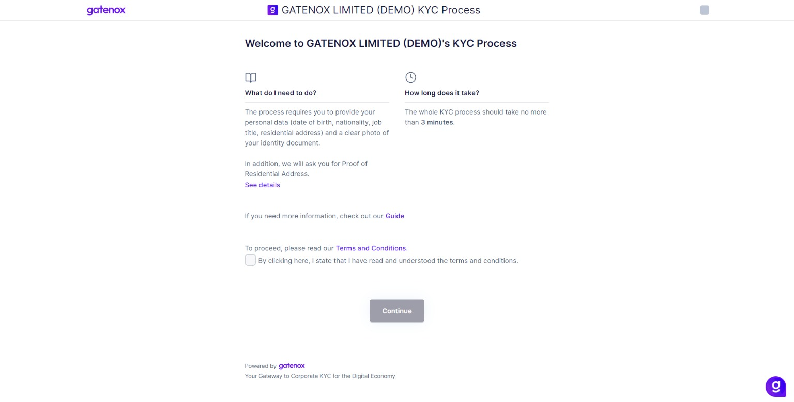
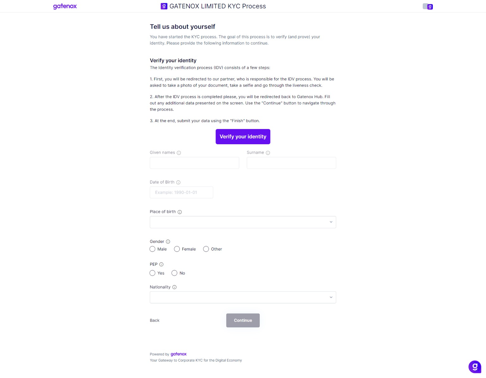
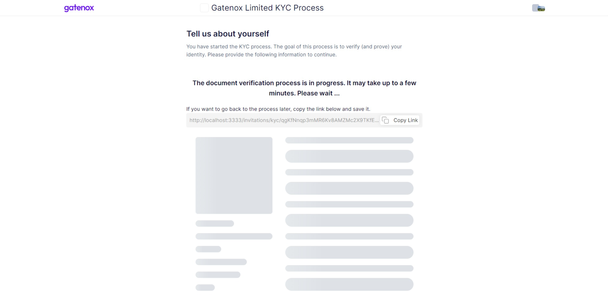
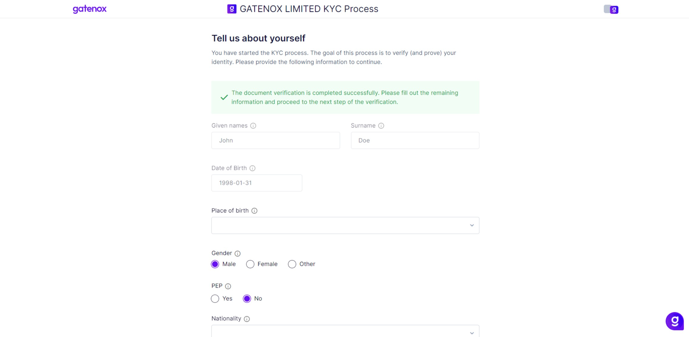
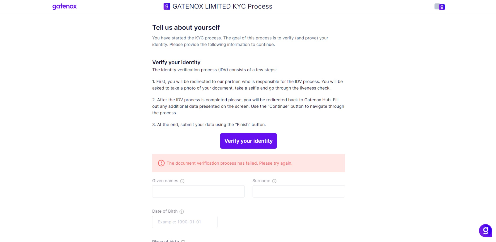

# Invitation for KYC

### :information\_source: Why did I receive an invitation?

If you received an email from the Gatenox Hub inviting you to the KYC process, it means that a Gatenox User has asked you to provide your personal identification details using Gatenox Hub. Usually, the main reason for this request is to:

1. add your personal data to the corporate profile of the company, where you perform one of the following functions: director, shareholder or you are UBO (Ultimate Beneficial Owner).
2. receive your personal data within the onboarding process.

<figure><figcaption>
Email - invitation for KYC
</figcaption></figure>

In the email, you can find information about who (demo@gatenox.com - this information is optional) and which company ((Demo Verifier LTD) invited you to the KYC process including their webpage and email / support contact in case you have any questions about the received invitation (information in the footer).

### :question: What should I do?

:warning: **Please remember that the link has a limited validity period. After its expiry, it is not possible to enter data.**

If you recognize the inviter, there are a few simple steps you need to do to add your personal data and share it with the inviter.

The KYC process involves the following steps to complete:

1. Personal data.
2. Residential address.
3. Identity document upload.

Please bear in mind that some fields may be already filled in for you by the inviter. In this case, you must review and correct the data if necessary.

To start the KYC process, please click on the "Start KYC" button in the email. You will be redirected to the Gatenox Hub, where you will be able to provide the required information without a need to login to our Portal.

### :tada: Welcome to the KYC process!

The first screen you see after starting the KYC process is the "Welcome" screen.&#x20;

<figure><figcaption>
KYC process - welcome screen
</figcaption></figure>

To start completing your data, please read our Terms and Conditions, check the box and press the "Continue" button.

The goal of the first step of the KYC process is to gather your personal data. Depending on where you are onboarding, it may:

1. include the IDV (identity verification)[#step-1-confirm-personal-data-using-the-idv-process](invitation-for-kyc.md#step-1-confirm-personal-data-using-the-idv-process "mention") or&#x20;
2. not include the IDV process[#step-1-provide-personal-data](invitation-for-kyc.md#step-1-provide-personal-data "mention").

### :adult: Step 1 - Confirm personal data using the IDV process

#### If the IDV (identity verification) process is required

If the IDV is required, on the first step of the process you will notice the "Verify your identity" button and additional information about the IDV process.

Read the instructions, prepare your ID document, and press the "Verify your identity" button. You will be redirected to an external service where your document will be checked, you will take a selfie to perform a facematch and liveness test.

<figure><figcaption>
KYC process  with IDV - step 1
</figcaption></figure>

To find out more about the IDV process itself please take a look at the product tour: [https://sumsub.com/sdk-tour/?start=true](https://sumsub.com/sdk-tour/?start=true)


While the process can begin on a computer browser, using a mobile device is recommended for ease of taking document photos, selfies, and performing the liveness test. Your computer's browser will simultaneously display the progress of the ID Verification (IDV) process.

Upon completing the process, you will be informed about the option to return to your computer’s browser screen.&#x20;


#### Waiting time

The document verification process usually does not take more than 30 seconds, but in some cases, it may take more time. In such a situation the waiting screen will be presented.

<figure><figcaption>
KYC process - loading screen
</figcaption></figure>

Once the IDV process is complete, you will be redirected to Gatenox Hub. The IDV process may result:

1. Positively - this means your identity has been confirmed and you can proceed.
2. Negatively - it means there was a problem with confirming your identity using the provided document. Also, the face match or liveness test may be failed.

#### IDV process finished successfully

If the IDV process is successful you will see a success message. Some of the required data will be completed and now you should complete the rest of the fields.

<figure><figcaption>
KYC process - IDV finished sucessfully
</figcaption></figure>

After providing all required information press the "Continue" button and proceed to step 2: [#step-2-residential-address](invitation-for-kyc.md#step-2-residential-address "mention").

#### IDV process failed

If the IDV process fails, the Gatenox Hub will present a proper error message. It may include additional information about the reason - why it fails.

Please check the error message and you can try again.

<figure><figcaption></figcaption></figure>

### :adult: Step 1 - Provide personal data

#### When the IDV (identity verification) process is not required

If the IDV is not required, you will need to provide all data by yourself. This step requires you to enter your personal data including:

* surname and given names
* date of birth
* gender
* nationality
* information about sources of funds (if required).

<figure><figcaption>
KYC process - personal data without IDV
</figcaption></figure>

Please provide the required information and click on the "Continue" button to move to the next step.

### :house: Step 2 - Residential address

The second step requires you to provide your residential address.

<figure><figcaption>
KYC process - residential address
</figcaption></figure>

Please provide the required information and click on the "Continue" button to move to the next sub-step, which asks you to upload proof of your residential address. In most cases, this is optional.

<figure><figcaption>
KYC process - residential address proof
</figcaption></figure>

Please provide the required information and click on the "Continue" button to move to the next step.

### :page\_facing\_up:Step 3 - Identity document upload

In this step, you are asked to upload photos of your documents.


If the IDV process was used to verify your identity, this screen will present your document information and photos. There is no need for any action on your side - press the "Finish" button to complete the process.


It is required to verify the information you have provided in the previous steps. Please provide the required information and click on the "Finish" button to move to the next step.

<figure><figcaption>
KYC process - identity document upload
</figcaption></figure>

In case you have skipped some required data you will be notified after clicking the "Finish" button and your data will not be submitted. You'll still be able to add other details while your invitation is active.

After clicking on the "Finish" button, the "Thank you" screen will be presented or you also might be redirected to the original webpage.

<figure><figcaption>
KYC process - thank you
</figcaption></figure>
