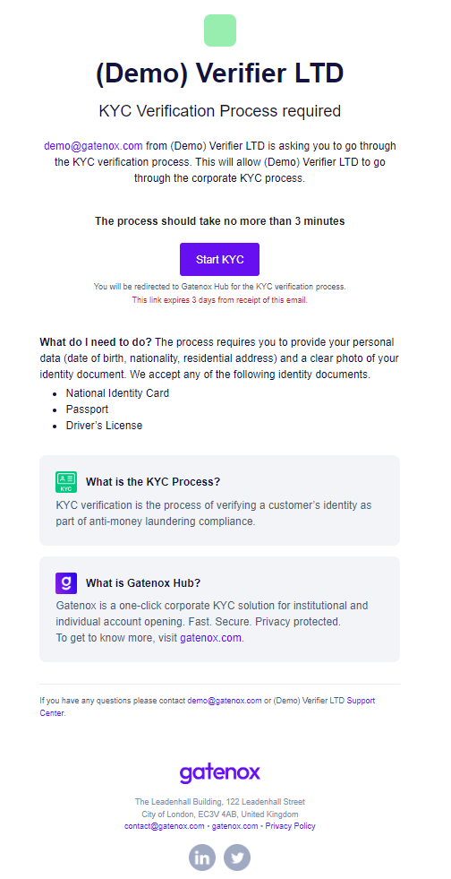
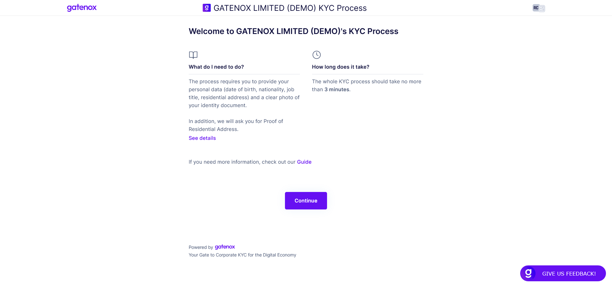
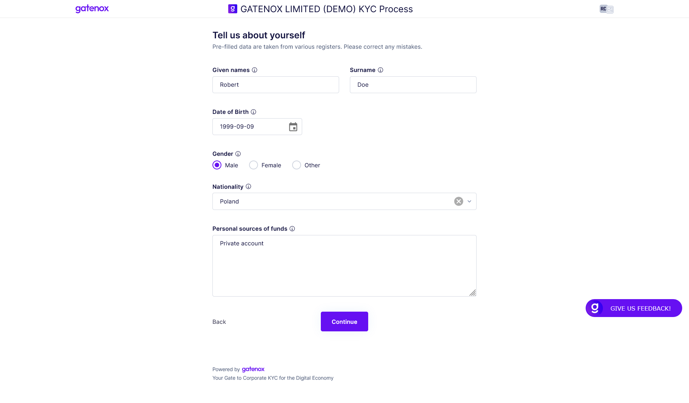
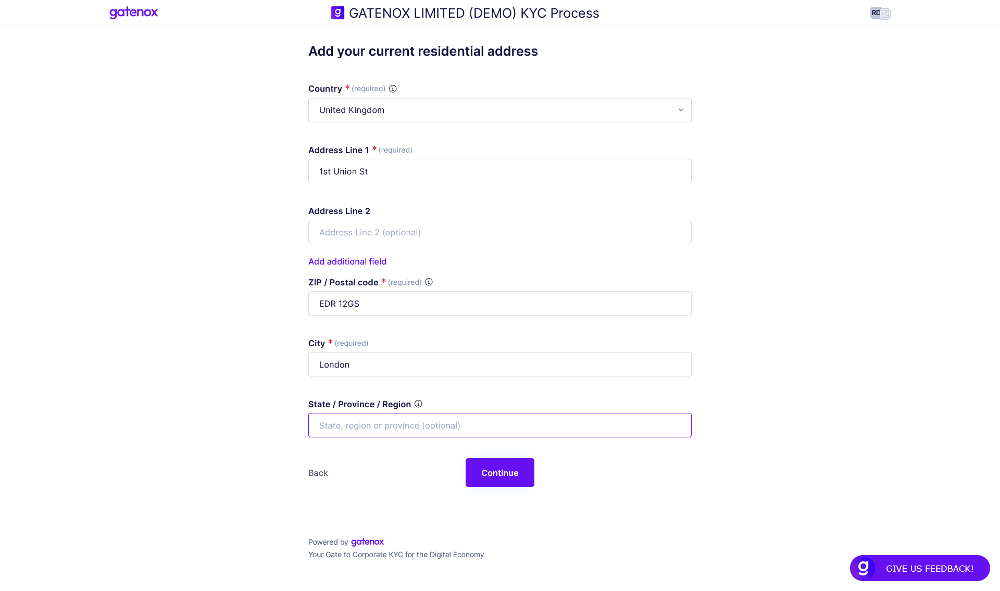
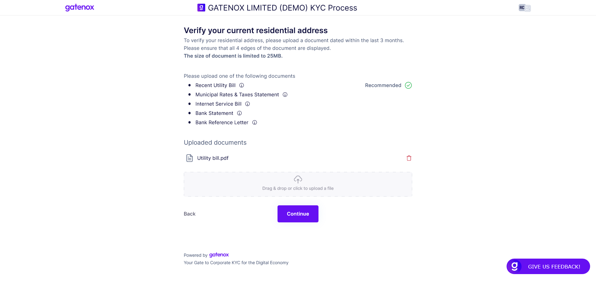
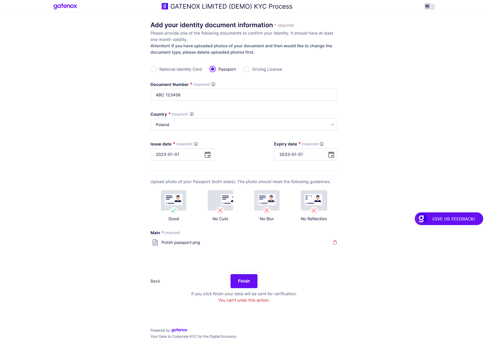
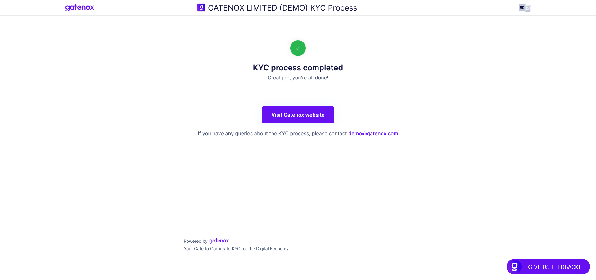

# Invitation for KYC

### :information\_source: Why did I receive an invitation?

If you received an email from the Gatenox Hub inviting you to the KYC process, it means that a Gatenox User has asked you to provide your personal identification details using Gatenox Hub. Usually, the main reason for this request is to add your personal data to the corporate profile of the company, where you perform one of the following functions: director, shareholder or you are the UBO (Ultimate Beneficial Owner).

<figure><figcaption>
Email - invitation for KYC
</figcaption></figure>

In the email, you can find information about who (demo@gatenox.com) and which company ((Demo Verifier LTD) invited you to the KYC process including their webpage and email / support contact in case you have any questions about the received invitation (information in the footer).

### :question: What should I do?

:warning: **Please remember that the link has a limited validity period. After its expiry, it is not possible to enter data.**

If you recognize the inviter, there are a few simple steps you need to do to add your personal data and share it with the inviter.

The KYC process involves the following steps to complete:

1. Personal data.
2. Residential address.
3. Identity document upload.

Please bear in mind that some fields may be already filled in for you by the inviter. In this case, your role is to review and correct the data if necessary.

To start the KYC process, please click on the "Start KYC" button in the email. You will be redirected to the Gatenox Hub, where without a need to login to our Portal, you will be able to provide required information.

### :tada: Welcome to the KYC process!

The first screen you see after starting the KYC process is the "Welcome" screen.&#x20;

<figure><figcaption>
KYC process - welcome screen
</figcaption></figure>

To start completing your data, press the "Continue" button.

### :adult: Personal data

The first step of the process requires you to enter your personal data including:

* surname and given names
* date of birth
* gender
* nationality
* information about sources of funds (if required).

<figure><figcaption>
KYC process - personal data
</figcaption></figure>

Please provide the required information and click on the "Continue" button to move to the next step.

### :house: Residential address

The second step requires you to provide your residential address.

<figure><figcaption>
KYC process - residential address
</figcaption></figure>

Please provide the required information and click on the "Continue" button to move to the next sub-step, which asks you upload a proof of your residential address. In most cases, this is optional.

<figure><figcaption>
KYC process - residential address proof
</figcaption></figure>

Please provide required information and click on the "Continue" button to move to the next step.

### :page\_facing\_up:Identity document upload

In this step you are asked to upload photos of your documents. It is required to verify the information you have provided on the previous steps.

<figure><figcaption>
KYC process - identity document upload
</figcaption></figure>

Please provide required information and click on the "Finish" button to move to the next step.

In case you have skipped some required data you will be notified after clicking the "Finish" button and your data will not be submitted. You'll still be able to add other details while your invitation is active.

:warning: **If all required data has been entered, after clicking on the "Finish" button you will not be able to change it.**

After clicking on the "Finish" button, the "Thank you" screen will be presented.

<figure><figcaption>
KYC process - thank you
</figcaption></figure>
