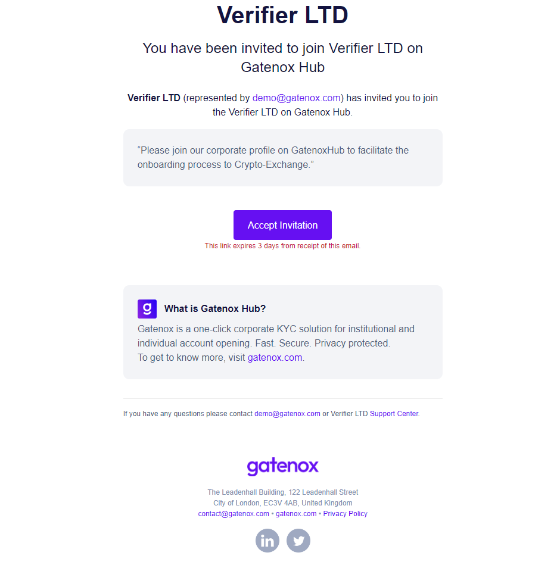
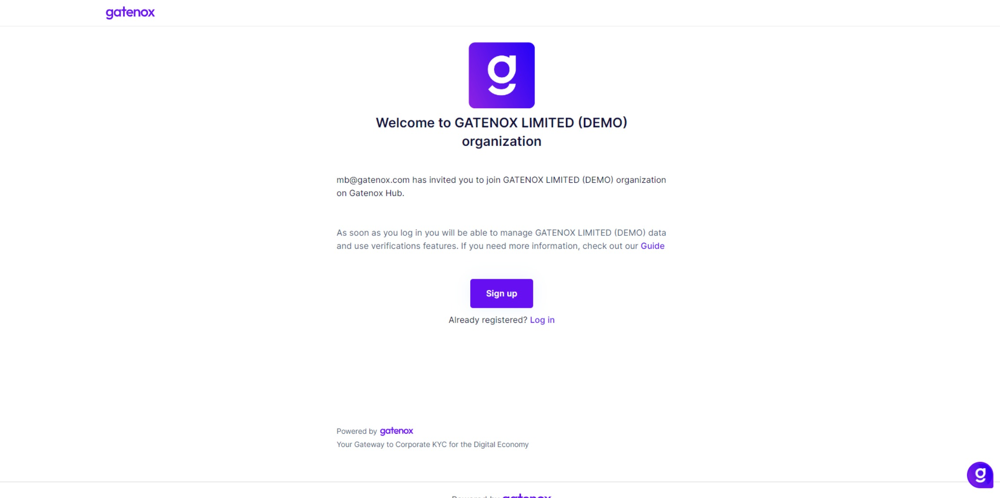
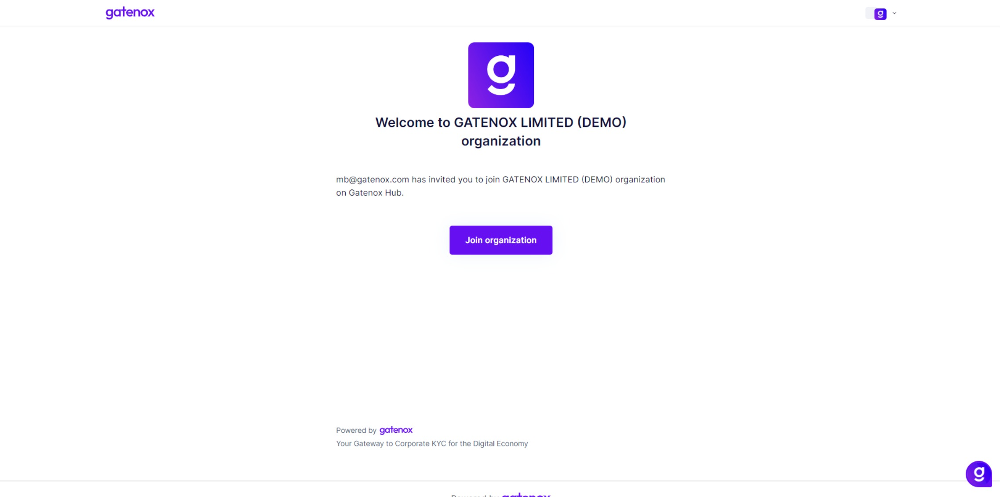

# Invitation to team

### :information\_source: Why did I receive an invitation?

If you received an email from the Gatenox Hub inviting you to the corporate profile, it means that the Gatenox User has invited you to join the corporate profile and be a part of a team.

<figure><figcaption>
Invitation to context
</figcaption></figure>

In the email, you can find information about who (demo@gatenox.com) and which company (Verifier LTD) invited you to the corporate profile, including the webpage and email/support contact in case you have any questions about the received invitation (information in the footer).

### :question: What should I do?

If you recognize the inviter, there are a few simple steps you need to do to join the inviter's organization and start completing the company profile.

Click on the "Accept invitation" button and you will be redirected to the welcome page.

In case you are new to the Gatenox Hub, you can sign up (create a new account) and you will be automatically added to the inviter's corporate profile.&#x20;

<figure><figcaption>
Invitation to context - welcome screen
</figcaption></figure>

If you already have a Gatenox account and you are logged in to the Gatenox Hub, you will see a join organization screen.

<figure><figcaption>
Invitation to context - join organization
</figcaption></figure>

After creating the account or joining the organization, the home page will be displayed. Now you can start completing your corporate profile and share it with partners!
