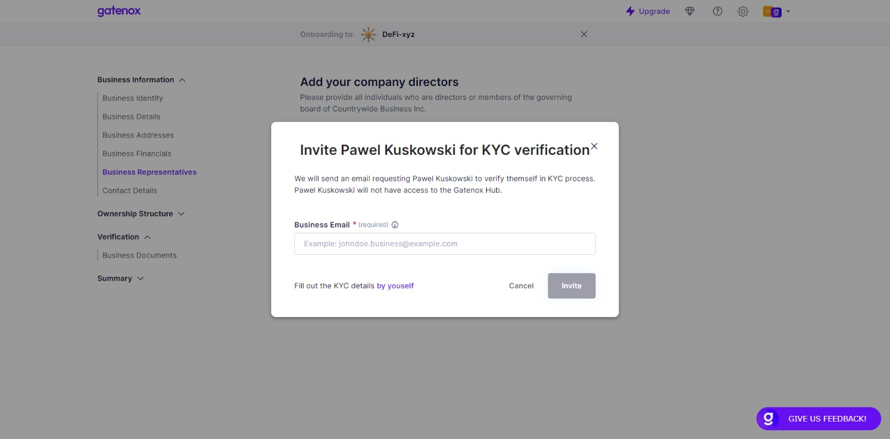

# Complete KYC details

If you own individual identity data, the quickest way to complete the profile is to add it on your own.

To do it, insead of inviting someone to KYC process click on "Fill out the KYC details by yourself".

<figure><figcaption>
Invitation to KYC
</figcaption></figure>

Below you can find an example of completing individual data. The same screens will be presented in case of individual shareholders or UBOs. The data presented on the screen may be different - it depends on the verifier requirements.

<figure><figcaption>
KYC details - complete by yourself 
</figcaption></figure>

