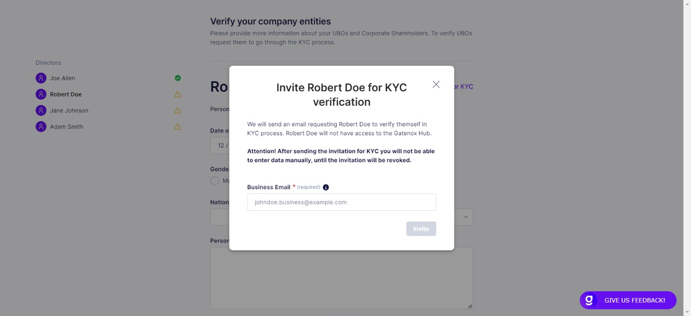
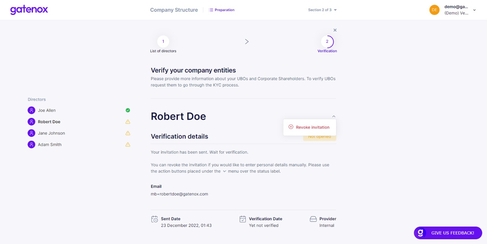
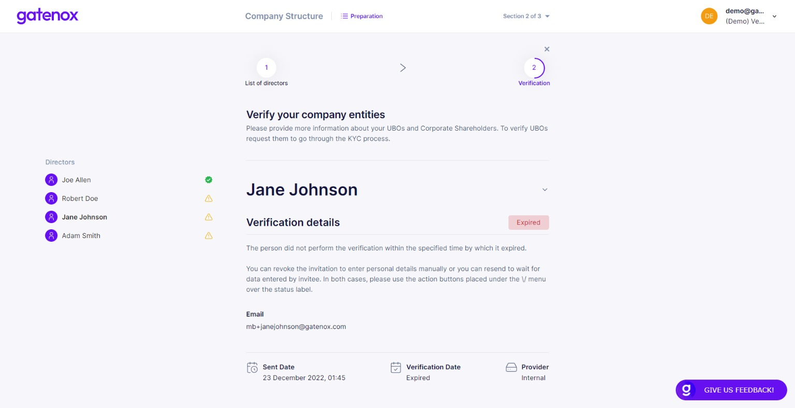
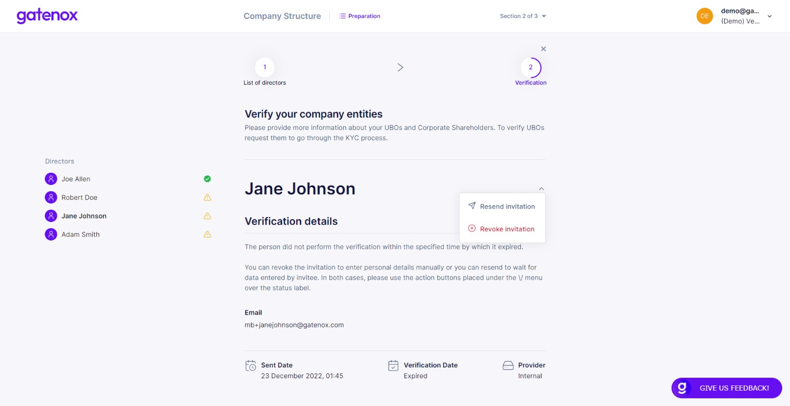
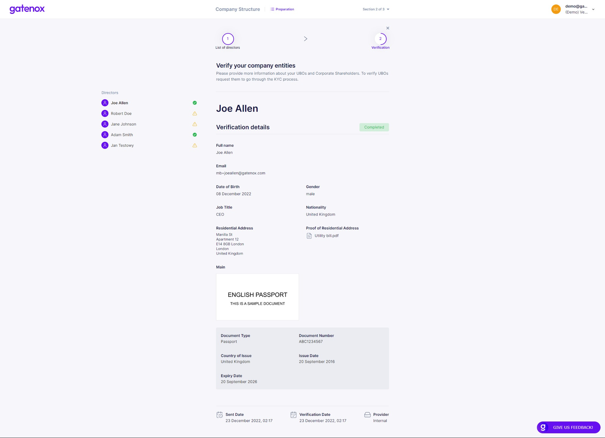

# Invite for KYC

If you are not in possession of director / shareholder / UBO identity data, you can simply send an invitation for KYC to this person.

The person will receive an invitation email and can follow the step described here: [invitation-for-kyc.md](../i-received-email-from-gatenox/invitation-for-kyc.md "mention").

Meanwhile you can monitor their process on your side. The invitations can have different statuses.

### Send the invitation for KYC

To send an invitation, click on the "Invite to KYC" link next to the individual's name. The pop up window will be displayed.

<figure><figcaption>
Invite for KYC - send invitation to email address
</figcaption></figure>

Please enter the individual's email address and press the "Invite" button to send the invitation email to your director. You can learn more about invitation statuses here: [.](./ "mention").

### Not opened

This is the first status after sending the invitation. It means that the invitation was sent but not opened.&#x20;

<figure><figcaption>
KYC status - not opened
</figcaption></figure>

In this status you are not able to enter any individual's data to Gatenox Hub. You can revoke the invitation and add data using the menu next to the individual's name. The invitation will be revoked and you can follow the process described here: [complete-kyc-details.md](complete-kyc-details.md "mention").

<figure><figcaption>
KYC status - not opened, actions
</figcaption></figure>

### In progress

If the invitation is opened the status will change to "In progress".

<figure><figcaption>
KYC status - in progress
</figcaption></figure>

In this status you are not able to enter any individual's data to Gatenox Hub. You can revoke the invitation and add data using the menu next to the individual's name. The invitation will be revoked and you can follow the process described here: [complete-kyc-details.md](complete-kyc-details.md "mention").

<figure><figcaption>
KYC status - in progress, actions
</figcaption></figure>

### Expired

The invitation is active for a limited time only. If the time expires, the invitation will change status to "Expired.

<figure><figcaption>
KYC status - expired
</figcaption></figure>

In this status you are not able to enter any individual's data to Gatenox Hub. You can revoke the invitation and add data using the menu next to the individual's name. The invitation will be revoked and you can follow the process described here: [complete-kyc-details.md](complete-kyc-details.md "mention").

Alternatively, you can resend the invitation and allow the individual to complete the profile on his own. The invitation will change status to "Not opened".

<figure><figcaption>
KYC status - expired, actions
</figcaption></figure>

### Completed

This status means that the individual has entered all required information. You can see all details uploaded by the person.

<figure><figcaption>
KYC status - completed
</figcaption></figure>
