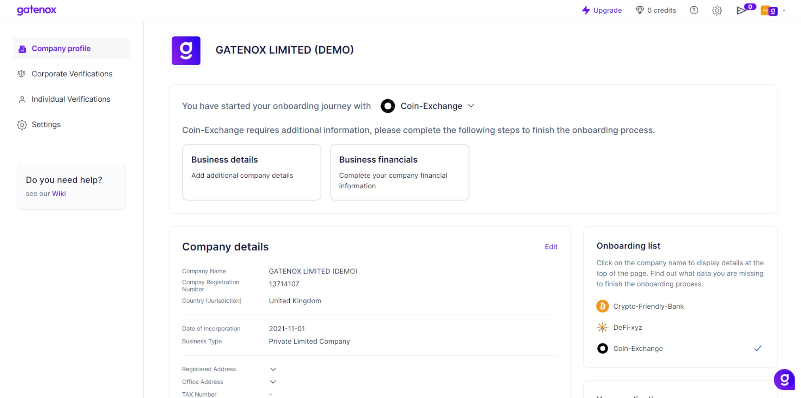
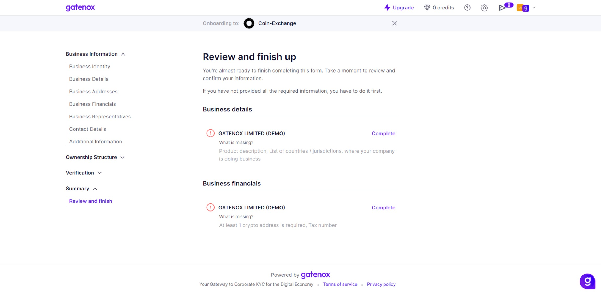

# Complete required company data

The "Company Profile" screen provides a summary of their current onboarding progress and company profile information. This screen also displays notifications about any missing information that is required to complete the onboarding process.

<figure><figcaption>
Current onboarding - missing data required by Partner
</figcaption></figure>

The notifications are grouped into nine areas, plus a "Summary" section:

1. Business Identity: This section includes information about the legal name, registration number, and other identifying details of the business: [business-identity.md](../create-and-complete-company-profile/manage-company-details/business-identity.md "mention").
2. Business Details: This section includes information about the industry, company size, website, and other details about the business: [business-details.md](../create-and-complete-company-profile/manage-company-details/business-details.md "mention").
3. Business Addresses: This section includes information about the physical and mailing addresses of the business: [business-addresses.md](../create-and-complete-company-profile/manage-company-details/business-addresses.md "mention").
4. Business Financials: This section includes information about the financial data, such as TAX number or crypto addresses list:[business-financials.md](../create-and-complete-company-profile/manage-company-details/business-financials.md "mention").
5. Business Representatives: This section includes information about the people who represent the business, such as directors and representatives:[business-representatives.md](../create-and-complete-company-profile/manage-company-details/business-representatives.md "mention").
6. Contact Details: This section includes information about the main point of contact for the business, such as the email address and phone number: [contact-details.md](../create-and-complete-company-profile/manage-company-details/contact-details.md "mention").
7. Shareholders: This section includes information about the shareholders of the business, such as their names and percentage of ownership: [shareholders.md](../create-and-complete-company-profile/create-modify-ownership-structure/shareholders.md "mention").
8. Proposed UBOs: This section includes information about the proposed ultimate beneficial owners (UBOs) calculated based on data provided on "Shareholder" screen: [proposed-ubos.md](../create-and-complete-company-profile/create-modify-ownership-structure/proposed-ubos.md "mention").
9. UBOs: This section includes information about the actual ultimate beneficial owners (UBOs) of the business, if applicable: [ubos.md](../create-and-complete-company-profile/create-modify-ownership-structure/ubos.md "mention").

Find out more about completing your profile based on Partner's requirements in the linked docs.

Alternatively, you can check the details of missing data on the "Review and finish" screen ([review-and-finish.md](../create-and-complete-company-profile/summary/review-and-finish.md "mention")).

<figure><figcaption>
Review and finish - missing data
</figcaption></figure>

If you have completed all data required by Partner let's share your profile: [share-my-profile.md](share-my-profile.md "mention").
