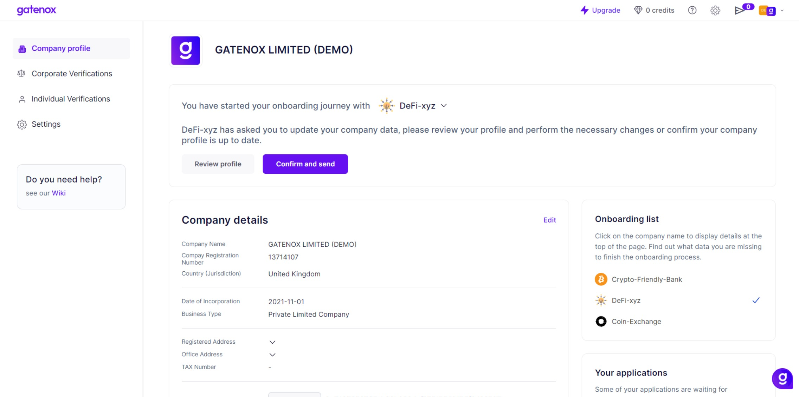

# Start onboarding

You can add a service provider (also called "Gatenox Partners") in two ways.

The service provider, which allows business users to send company profile (documents and data) using Gatenox has 2 methods to invite business users to apply using Gatenox Hub:

1. The Partner can send you an invitation email with the link. More information about invitation emails can be found here: [invitation-for-verification.md](../i-received-email-from-gatenox/invitation-for-verification.md "mention").
2. The Partner can implement a button on the service webpage.

<figure><figcaption>
"Apply via Gatenox" button
</figcaption></figure>

In both cases after clicking on the link, you will be redirected to the Gatenox Hub login / sign-up page and after the successful login / sign-up, the partner's name will be added to your "Onboarding list". Your "Onboarding list" is presented on the right side of the "You company profile" screen.

Depending on your profile requirements there are 3 possible scenarios.

#### First onboarding

It is the first time you are sharing your company data with this service and your profile has all the data required by the service provider - in this case, you can automatically send data to Partner. This situation usually happens during the second or later onboarding, when most of the data has been already entered. Learn more here: [share-my-profile.md](share-my-profile.md "mention").

<figure><figcaption>
Onbaoridng process - profile ready to share
</figcaption></figure>

#### Recurring review

It is a recurring review process initiated by the service provider or you have been asked by the service provider to update the company data. Additionally, your profile has all the data required by the service provider - in this case, you should review your company profile and (depending on the result of your review) update and send your data to the service provider.

<figure><figcaption>
Recurring review - profile ready to share
</figcaption></figure>

#### Missing data

Your profile requires additional information - in this case, you are asked to complete your company profile. This situation usually happens after a new account is created during the first onboarding or for recurring review if the service provider requires additional data scope. Do not worry - we are here to guide you through the process. Let's move on to: [complete-required-company-data.md](complete-required-company-data.md "mention").&#x20;

<figure><figcaption>
Onboaridng process - missing data in the comapny profile
</figcaption></figure>
