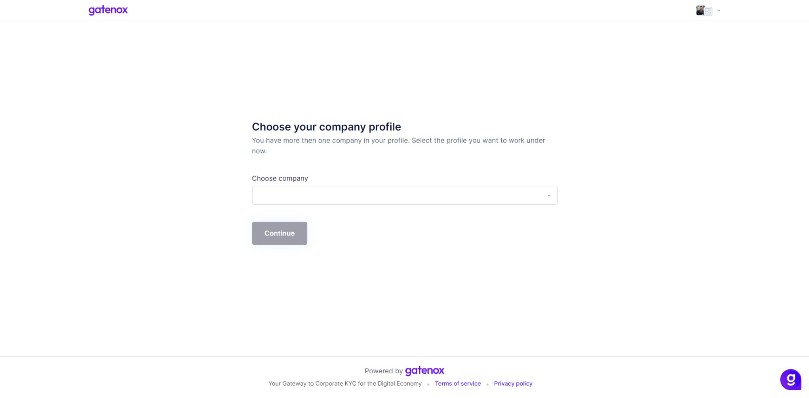

# What should I do after first login?

After the first login to Gatenox Hub, you will be redirected to the wizard, which will help you to add your first company.

<figure><figcaption>
Add new company
</figcaption></figure>

Please follow the guide presented here: [add-new-company.md](create-and-complete-company-profile/add-new-company.md "mention").

In case you already have a company profile attached to your account, you will be automatically logged in to your account. If your account involves more than 1 profile, you can pick the one, that you want to work with.

&#x20;

<figure><figcaption>
Choose company profile
</figcaption></figure>
