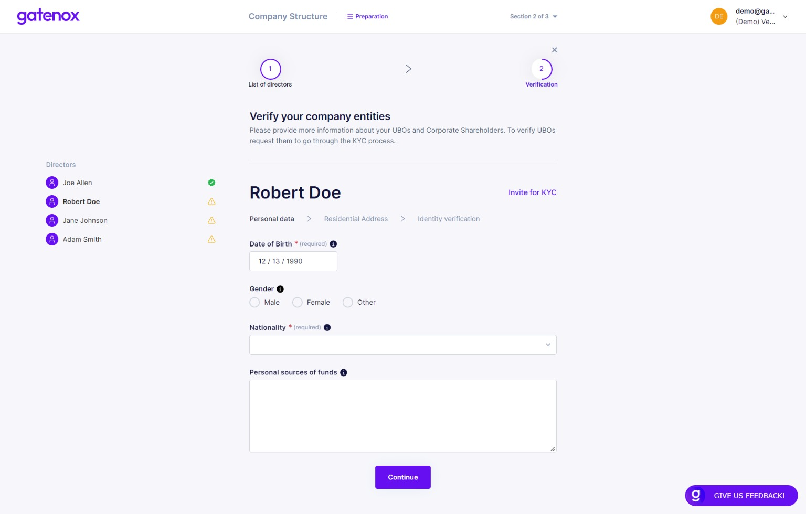
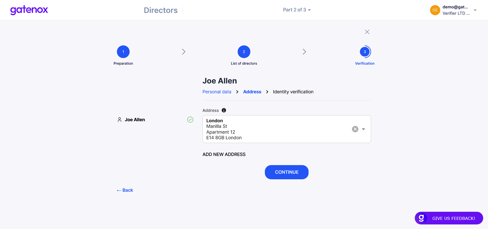
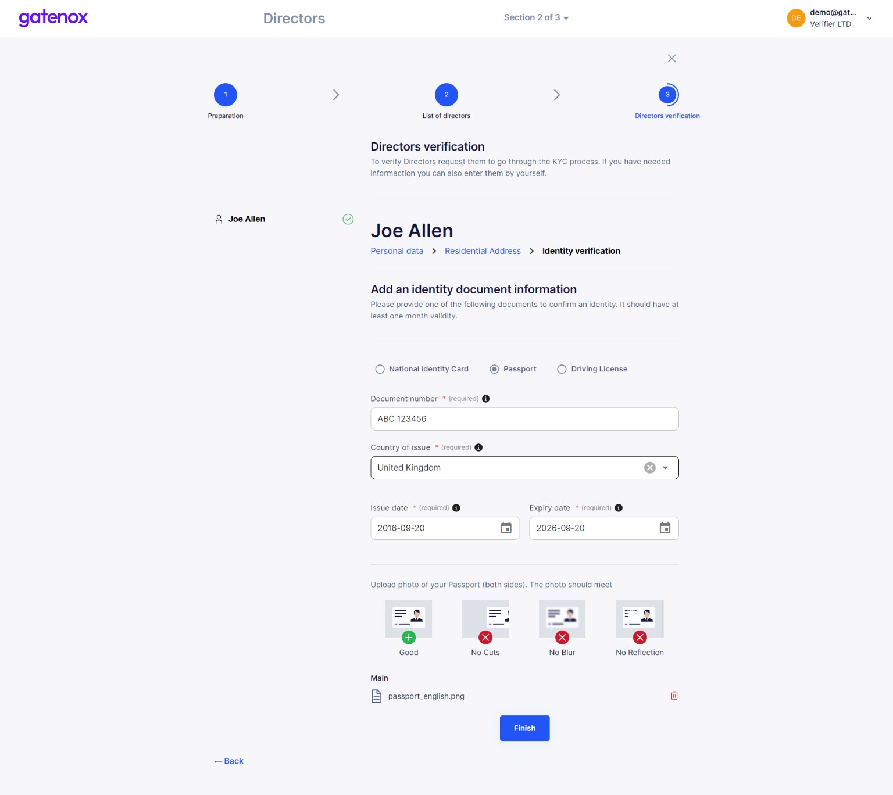
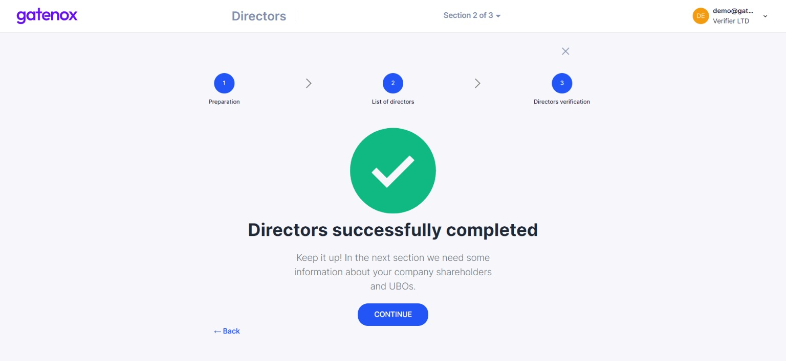

# Directors verification

The directors verification process involve providing personal data in the following areas:

1. Personal data.
2. Residential address.
3. Identity document.

You can navigate directly to "Directors verification" screen by clicking on "Directors verification" navigation element on the top of the screen.

### Directors verification

On the left side of the screen you will see a list of directors prepared on previous steps. You can switch between their names. If director name is followed by green "OK" icon then all required information has been provided. Click on "Continue" button after completing all required information to move to next step.

<figure><figcaption>
Directors - personal data
</figcaption></figure>

Now you can provide director's residential address - pick one from the list or enter new one manually. Click on "Continue" button after completing all required information to move to next step.&#x20;

<figure><figcaption>
Directors - residential address
</figcaption></figure>

In this step you are asked to provide directors identity document. Pick one of the following identity document types: passport, national ID card or driving license. After choosing the type, enter documents data (country of issue / citizenship, number, issue and expiry date) and upload document photo.

<figure><figcaption>
Directors - identity document
</figcaption></figure>

Repeat those steps for all directors included in your company's directors list.

It is the last step of completing data in "Directors" section of your profile. By pressing "Finish" button you will be redirected to "Thank you screen".

<figure><figcaption>
Directors - required data completed
</figcaption></figure>

In the next section you will be asked to provide details about your company structure. If you were only modifying part of your data, you can click on "X" button to go back to "Your company profile" screen.
