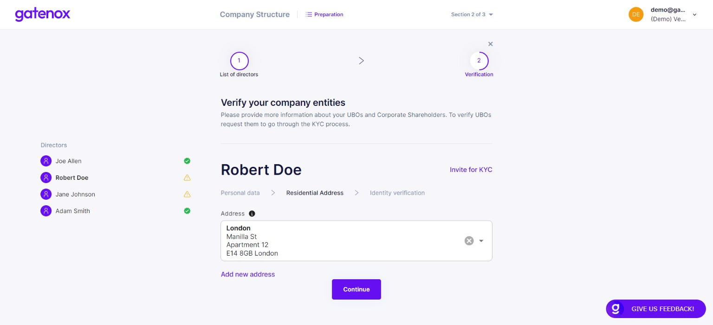

# Directors verification

The directors verification process involves providing personal data in the following areas:

1. Personal data.
2. Residential address.
3. Identity document.

You can navigate directly to the "Directors verification" screen by clicking on the "Directors verification" navigation element on the top of the screen.

### **Individuals verification**

The Gatenox Hub offers 2 ways of collecting individual identity data:

1. Data can be completed by the business user creating or managing the company's profile. In this scenario, the business user needs to be in possession of all required identity data and photos of identity documents belonging to directors / shareholders / UBOs added to the company's structure.
2. Send an invitation to the individual who has been added to the company's structure to complete the data. This scenario offers the business user the option of inviting the individual to complete the identity data and upload document photos on their own. Learn more here: [invitation-for-kyc.md](../../i-received-email-from-gatenox/invitation-for-kyc.md "mention").

Please remember that you can mix these 2 methods within your profile.

### Directors verification - complete data by user

On the left side of the screen you will see a list of directors given in previous steps. You can switch between their names. If the director name is followed by a green "OK" icon then all required information has been provided. Click on the "Continue" button after completing all required information to move to the next step.

<figure><figcaption>
Directors - personal data
</figcaption></figure>

Now you can provide the director's residential address - pick one from the list or enter a new one manually. Click on the "Continue" button after completing all required information to move to the next step.

<figure><figcaption>
Directors - residential address
</figcaption></figure>

In this step you are asked to provide the director's identity document. Pick one of the following identity document types: passport, national ID card or driving license. After choosing the type, enter documents data (country of issue / citizenship, number, issue and expiry date) and upload document photo.

<figure><figcaption>
Directors - identity document
</figcaption></figure>

Repeat these steps for all directors included in your company's directors list. This is the last step of completing data in the "Directors" section of your profile.

### Directors verification - invite for KYC

If you are not in possession of the identity data of your directors, you can invite them to upload their identity on their own.

To send an invitation click on the "Invite to KYC" link next to the director's name. The pop up window will be displayed.

<figure><figcaption>
Invite for KYC - send invitation to email address
</figcaption></figure>

Please enter your director's email address and press the "Invite" button to send the invitation email to your director. You can learn more about invitation statuses here: [kyc-process](../../kyc-process/ "mention").

In the next section you will be asked to provide details about your company structure. If you were only modifying part of your data, you can click on "X" button to go back to "Your company profile" screen.
