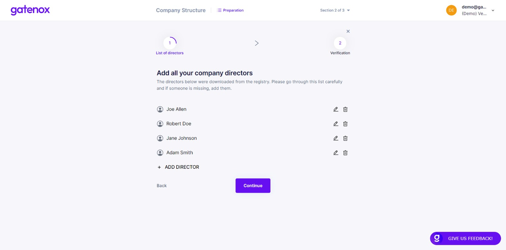
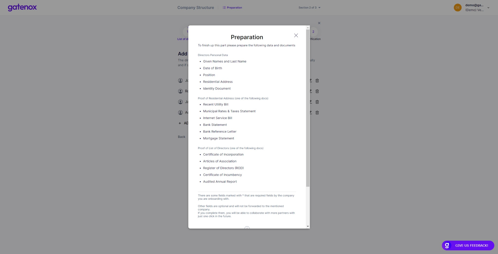

# List of directors

In case you need to add or correct your company list of directors or directors' personal details, please navigate to the "Company profile" menu and click _Edit_ in "Directors" section. The "List of directors" screen will be displayed.

### List of directors

If your company has been found in the company register in the relevant country, the list of directors will be downloaded to facilitate the process and save your valuable time.

<figure><figcaption>
List of directors
</figcaption></figure>

In case you would like to know more about completing details of your company's directors, you can click on the "Preparation" link in the top menu. The popup windows will be displayed presenting additional information. Click on "Understand" button to go back to the "List of directors" screen.

<figure><figcaption>
Directors - preparation
</figcaption></figure>

If downloaded data is not up-to-date or any other changes are required you can add, edit or delete a person from the list. When the list is ready, click on the "Continue" button to enter the director's details.

<figure><figcaption>
Directors - details
</figcaption></figure>

Now, you can add position and date of birth for each of the directors. When you have completed all required information, click on the "Continue" button to provide proof of entered data.

<figure><figcaption>
Proof of directors list
</figcaption></figure>

In this step you will be asked to provide a document verifying your list of directors. Depending on your company's country of residence and type, you can provide relevant documents to support this list. When you are ready, press "Continue" button to add the personal details (KYC) of your directors.

If you were only modifying part of your data, you can click on "X" button to go back to "Your company profile" screen.
