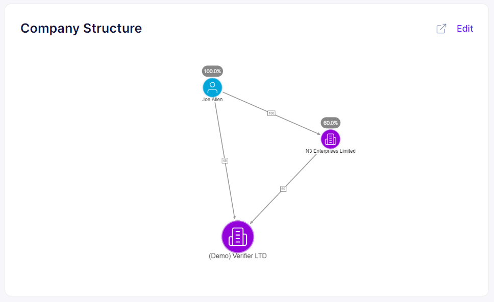

# Create / modify company structure

You can edit your company structure by clicking on the "Edit" button in the "Company structure" section of the "Your company profile" screen.

<figure><figcaption>
Your company profile - edit company structure
</figcaption></figure>

You will be redirected to data edit wizard, including the following steps:

1. Shareholders structure - tree and graph view of your company shareholders.
2. UBO - a list of your company UBOs and additional justification, if required.
3. Shareholders verification - identity details of individual shareholders and registration data for corporate ones.
