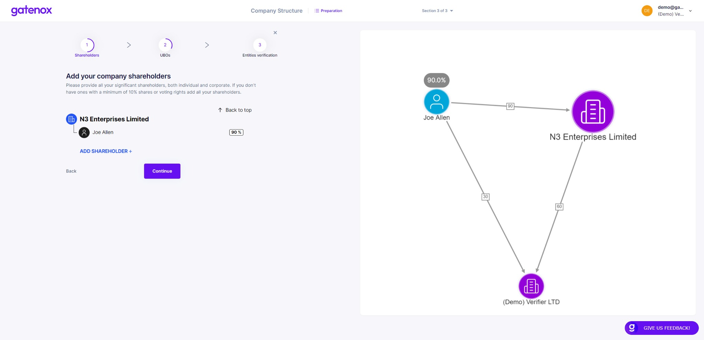

# Shareholders structure

In case you need to add or correct your company structure or shareholders and UBOs details, please navigate to the "Company profile" menu and click _Edit_ in the "Company structure" section. The "Preparation" screen will be displayed.

<figure><figcaption>
Company structure - preparation
</figcaption></figure>

Please click on the "Continue" button to start creating or modify your company shareholders structure.

### Shareholders - create structure

To add new shareholder to the structure, click on the "Add shareholder +" button. You will be asked to define shareholders type:

1. Individual - please provide given names, last name and add % of shares owned by the shareholder.&#x20;
2. Corporate - please provide the company name and add % of shares owned by the shareholder.

<figure><figcaption>
Company shareholders - tree and graph view
</figcaption></figure>

If you have already added someone to your company profile (for example: a person in a role of director) you can easily select an individual from the list. To add a new shareholder to the company structure press the "Add new person" or "Add new company" button.

If required, you will be asked to provide more details (company number and jurisdiction or KYC details) in the next steps.

### Corporate shareholders - add structure

In case of the corporate shareholder, you can also provide their structure, by clicking on the company name presented on the tree view. &#x20;

<figure><figcaption>
Company structure - corporate shareholder's structure
</figcaption></figure>

The process is the same - just add shareholders using the "Add shareholder +" button. All persons / companies added previously are reusable - if you added a person (individual shareholder or director) or company on the previous level of the structure, just select it from the list of shareholders.

You can always go back to the top of the structure by clicking on the "Back to top" button.

After completing your company structure click on the "Continue" button to provide details about your UBOs.

If you were only modifying part of your data, you can click on "X" button to go back to "Your company profile" screen.
