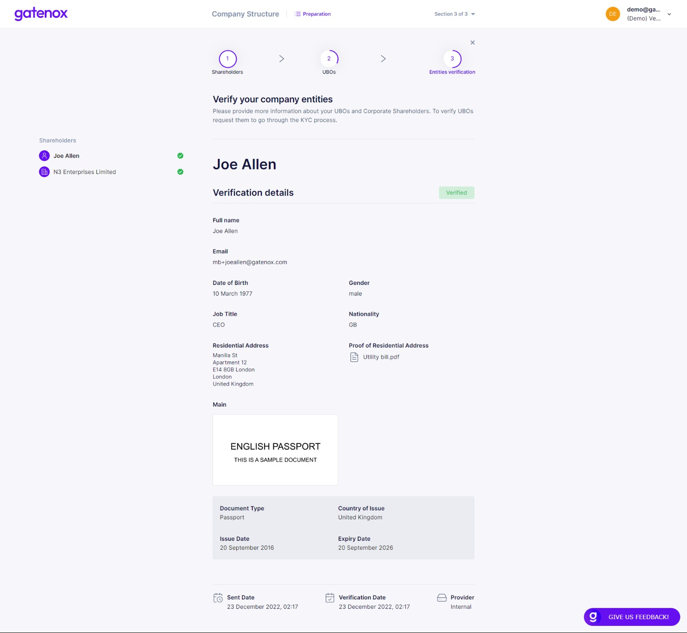

# Shareholders verification

The last part of the company structure preparation is the process of providing details about your shareholders.

1. For individuals - the process looks the same as for directors verification (see more here: [directors-verification.md](../add-edit-directors/directors-verification.md "mention")).
2. For corporations- only limited data is collected (company number and jurisdiction) to perform sanction checks.

### Individual shareholders

The Gatenox Hub offers 2 ways of providing individuals identity data:

1. Complete all data by the business user, who is creating or managing the company's profile. In this scenario the business user needs to be in possession of all required identity data and photos of identity documents belonging to directors / shareholders / UBOs added to the company's structure.
2. Send the invitation to complete data to the person, who has been added to the company's structure. This scenario offers the business user the possibility of inviting the individual to complete the identity data and upload document photos on his own. You can learn more here about the invitation for KYC: [invitation-for-kyc.md](../../i-received-email-from-gatenox/invitation-for-kyc.md "mention").

Please remember that you can mix those 2 methods within your profile.

:warning: The individuals KYC has been described in details here: [kyc-process](../../kyc-process/ "mention")

On the left side of the screen you will see a list of shareholders prepared in previous steps. You can switch between individual names and company names. If the entity name is followed by a green "OK" icon then all required information has been provided.

<figure><figcaption>
Shareholders verification - individuals, personal data
</figcaption></figure>

### Corporate shareholders

For corporate shareholders only limited data is collected: company number and jurisdiction. This data allows us to perform a sanction screen.

<figure><figcaption>
Shareholders verification - corporates, company details
</figcaption></figure>

Repeat these steps for all corporate shareholders included in your structure.

This is the last step of completing data in the "Company shareholders" section of your profile.&#x20;

If you were only modifying part of your data, you can click on "X" button to go back to "Your company profile" screen.
