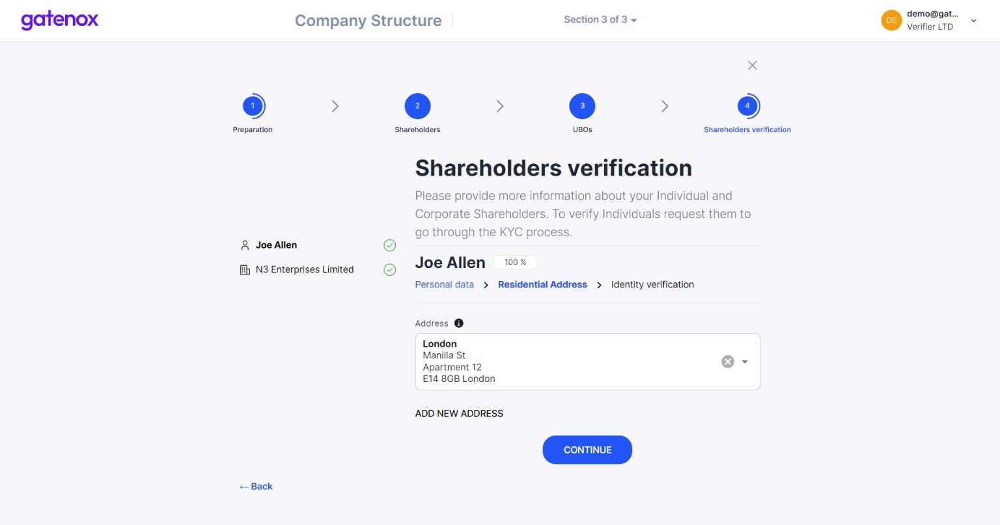
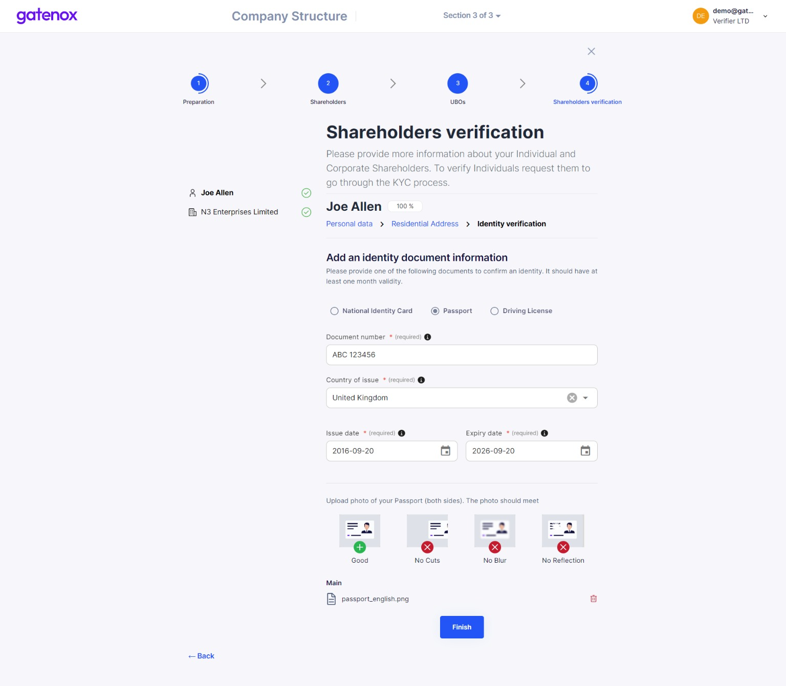
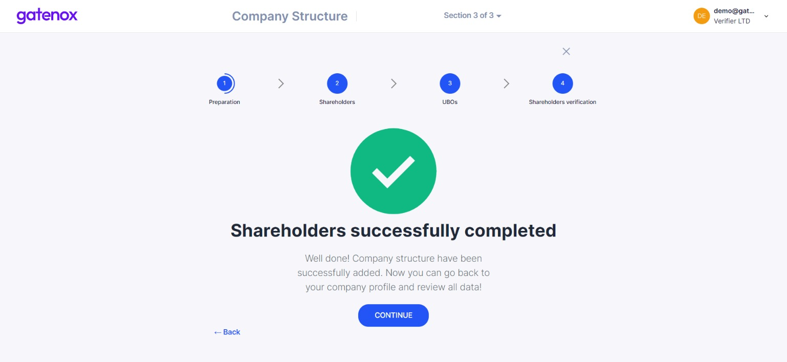

# Shareholders verification

The last part of the company structure preparation is the process of providing details about your shareholders.

1. For individuals - the process looks the same as for directors verification (see more here: [directors-verification.md](../add-edit-directors/directors-verification.md "mention")).
2. For corporations- only limited data is collected (company number and jurisdiction) to perform sanction checks.

### Individual shareholders

On the left side of the screen you will see a list of shareholders prepared on previous steps. You can switch between individual's names and company names. If the entity name is followed by a green "OK" icon then all required information has been provided. Click on the "Continue" button after completing all required information to move to the next step.

<figure><figcaption>
Shareholders verification - individuals, personal data
</figcaption></figure>

Now you can provide an individual shareholder's residential address - pick one from the list or enter a new one manually. Click on the "Continue" button after completing all required information to move to the next step.

<figure><figcaption>
Shareholders verification - individuals, residential address
</figcaption></figure>

In this step you are asked to provide an individual shareholder's identity document. Pick one of the following identity document types: passport, national ID card or driving license. After choosing the type, enter documents data (country of issue / citizenship, number, issue and expiry date) and upload document photo.

<figure><figcaption>
Shareholders verification - individuals, identity document
</figcaption></figure>

Repeat those steps for all individual shareholders included in your structure.

### Corporate shareholders

For corporate shareholders only limited data is collected: company number and jurisdiction. This data allows us to perform a sanction check.

<figure><figcaption>
Shareholders verification - corporates, company details
</figcaption></figure>

Repeat those steps for all corporate shareholders included in your structure.

It is the last step of completing data in the "Company shareholders" section of your profile. By pressing the "Continue" button you will be redirected to the "Thank you" screen.

<figure><figcaption>
Company structure - completed
</figcaption></figure>

If you were only modifying part of your data, you can click on "X" button to go back to "Your company profile" screen.
