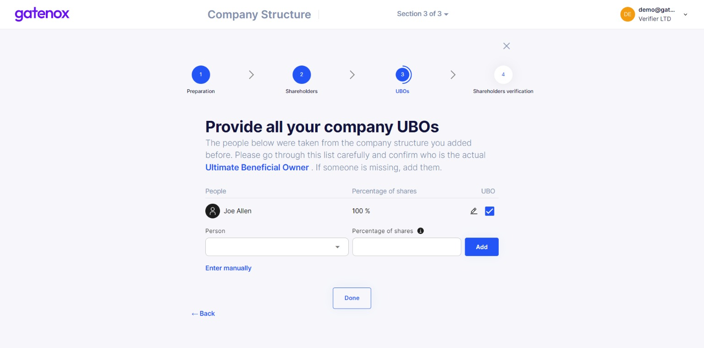
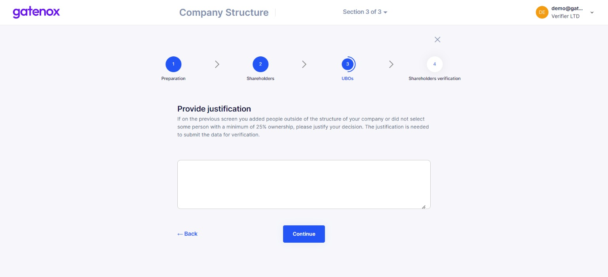

# UBOs

The UBOs definition screen involves a pre-classified list of UBOs. The classification of UBOs is made based on the company structure prepared in the previous step ([shareholders-structure.md](shareholders-structure.md "mention")).&#x20;

### UBOs

If you need to know who the UBO is, please click on the "Ultimate Beneficial Owner" link.

<figure><figcaption>
Company structure - UBO
</figcaption></figure>

On the list you can select (checkbox on the right side of the list) which one of your individual shareholders are real UBOs. In some situations you will not be able to place your UBO on the company structure prepared on the previous step. In this case, you can manually add UBO to the current list by clicking on the "Add UBO" button.

<figure><figcaption>
Company structure - list of UBOs
</figcaption></figure>

You can select a person previously added to your company profile or add a new one by clicking on the "Enter manually" link. In both cases, please add the percentage of shares controlled by the UBO.

### Justification

If you added UBO manually, you might be asked to provide justification. After clicking the "Done" button, the following screen will be displayed.

Please provide a relevant explanation and press the "Continue" button - you will be redirected to the shareholders verification screen.

<figure><figcaption>
Company structure - justification for the list of UBOs
</figcaption></figure>

If you were only modifying part of your data, you can click on "X" button to go back to "Your company profile" screen.
