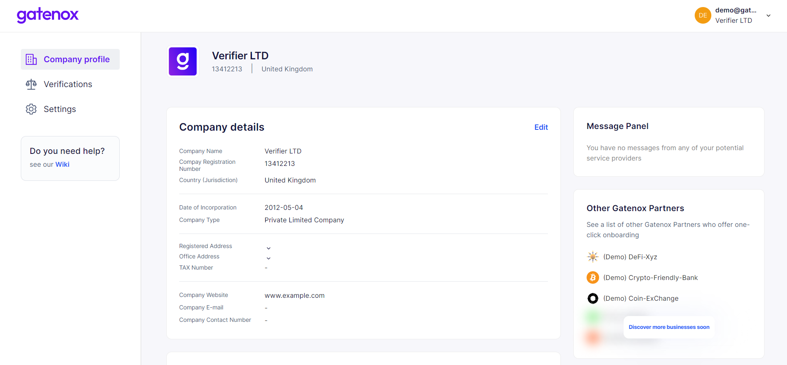

# Edit company details

You can edit your company details by clicking on the "Edit" button in the "Company details" section of the "Your company profile" screen.

You will be redirected to data edit wizard, including the following steps:

1. Basic company details + verification documents: [basic-data.md](basic-data.md "mention").
2. Company addresses + verification documents: [company-addresses.md](company-addresses.md "mention").
3. Business activity description, including basic financial information [business-description.md](business-description.md "mention").
4. Additional company details - other company information [other-company-details.md](other-company-details.md "mention").

<figure><figcaption>
Your company profile - edit company details
</figcaption></figure>
