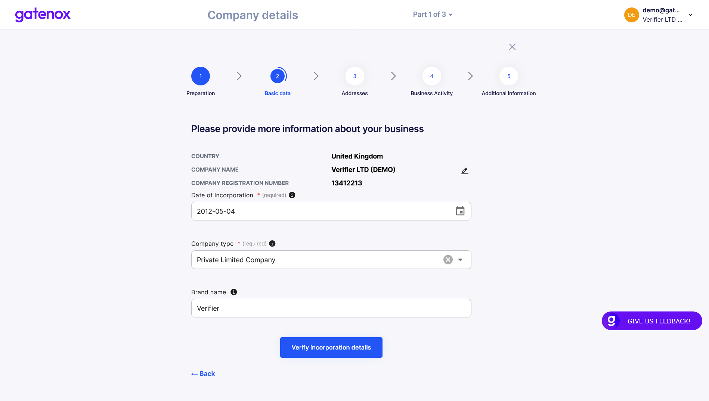

# Basic data

Your company registration data may change over time.

In case you need to correct your company registration details, please navigate to the "Company profile" menu and click _Edit_ in the "Company Details" section. The "Basic data" screen will be displayed.

### Basic data

Here, you can edit your company registration data.

<figure><figcaption>
Company basic data - registration info
</figcaption></figure>

In case you would like to know more about completing the company details, you can click on "Preparation" link in the top menu. The pop up window with additional informaction will be displayed.

<figure><figcaption>
Company details - preparation
</figcaption></figure>

Click the "Understand" button to go back to the "Basic data" screen.

After clicking on "Verify incorporation details" you will be moved to part of the process where you can add a list of documents confirming your registration data.

### Verify incorporation details

Here you can provide all necessary documents to verify your registration data. The list of documents depends on your company jurisdiction and type.

Please provide those which you consider the most relevant.

<figure><figcaption>
Company basic data - verification documents
</figcaption></figure>

After uploading the document, you can move to the next step where you will be asked to provide addresses related to your company.

If you were only modifying part of your data, you can click on "X" button to go back to "Your company profile" screen.
