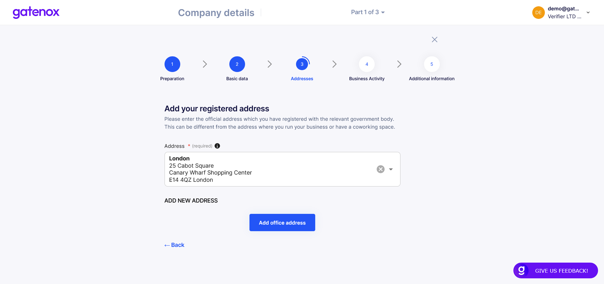

# Company addresses

In case you need to correct your company addresses or add verification documents (proof of address), please navigate to the "Company profile" menu and click _Edit_ in the "Company Details" section. The "Preparation" screen will be displayed.

<figure><figcaption>
Company details - preparation
</figcaption></figure>

Now, you can navigate directly to addresses by clicking on the "Address" navigation element on the top of the screen.

### Registered address

Here you can select an address from the existing list (downloaded from the company register or previously entered) or add new address manually, by clicking on "Add new address" link.&#x20;

<figure><figcaption>
Registration address
</figcaption></figure>

After selecting your company address click on the "Add office address" button to move to the next part - office address.

### Office address

The process of choosing an office address is the same as for a registration address.&#x20;

<figure><figcaption>
Office address
</figcaption></figure>

The last step of completing this part of the company profile is to add a verification document, proofing your office address. Click on the "Verify address" button.

### Verify office address

Add a document confirming your office address and all information regarding company address is completed.

<figure><figcaption>
Proof of office address
</figcaption></figure>

Now you can add more information to your profile in "Business activity" section. If you were only modifying part of your data, you can click on "X" button to go back to "Your company profile" screen.
