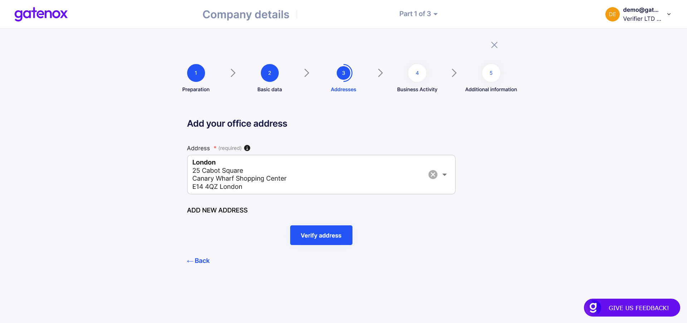

# Company addresses

In case you need to correct your company addresses or add verification documents (proof of address), please navigate to the "Company profile" menu and click _Edit in_ "Company Details" section. The "Preparation" screen will be displayed.

<figure><figcaption>
Company details - preparation
</figcaption></figure>

Now, you can navigate directly to addresses by clicking on "Address" navigation element on the top of the screen. Here you can select an address from existing list (downloaded form company register or previously entered) or add new address manually, by clicking on "Add new address" link.&#x20;

<figure><figcaption>
Registration address
</figcaption></figure>

After selecting your company address click on "Add office address" button to move to next part - office address. The process of choosing office address is the same as for registration address.&#x20;

<figure><figcaption>
Office address
</figcaption></figure>

The last step of completing this part of company profile is to add verification document, proofing your office address. Click on "Verify address" button.

<figure><figcaption>
Proof of office address
</figcaption></figure>

Add a document confirming your office address and all information regarding company address are completed.

Now you can add more information to your profile in "Business activity" section.
