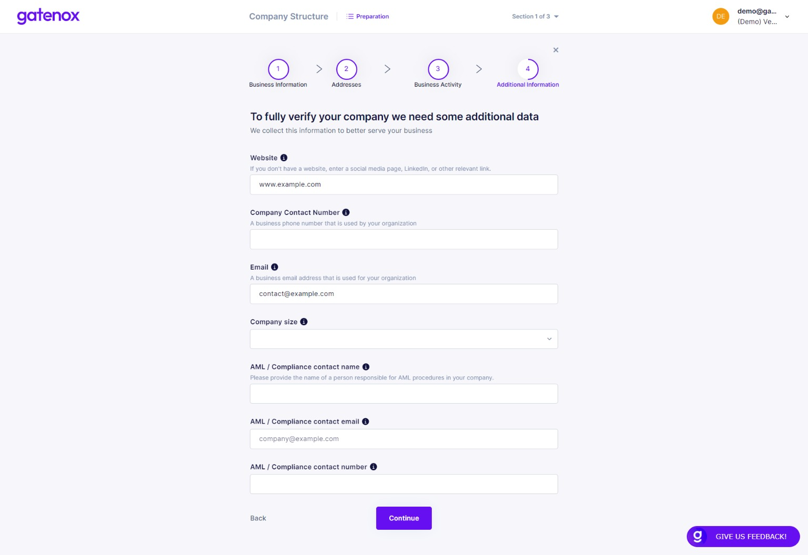

# Additional information

On this screen you will be able to add contact details to your profile.

To complete your profile with contact data, please navigate to the "Company profile" menu and click _Edit_ in the "Company Details" section. The "Preparation" screen will be displayed.

<figure><figcaption>
Contact details - preparation
</figcaption></figure>

Now, you can navigate directly to the additional information section by clicking on the "Additional information" navigation element on the top of the screen. Here you can enter your company website address, contact number and email, number of employees and provide the contact details for the person responsible for AML in your company.

<figure><figcaption>
Company details - additional information
</figcaption></figure>

This is the last step of completing data in the "Company details" section of your profile. By pressing the "Continue" button you will be redirected to the "Thank you screen".

<figure><figcaption>
Company details - required data completed
</figcaption></figure>

In the next section you will be asked to provide details about your company directors. If you were only modifying part of your data, you can click on "X" button to go back to "Your company profile" screen.
