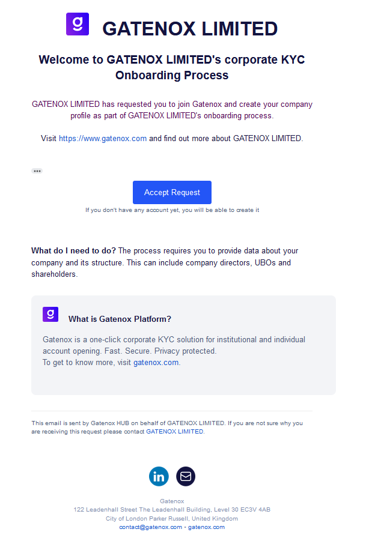
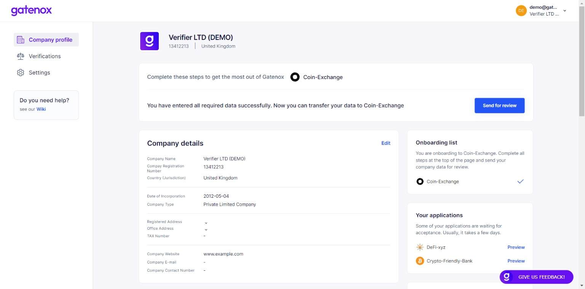
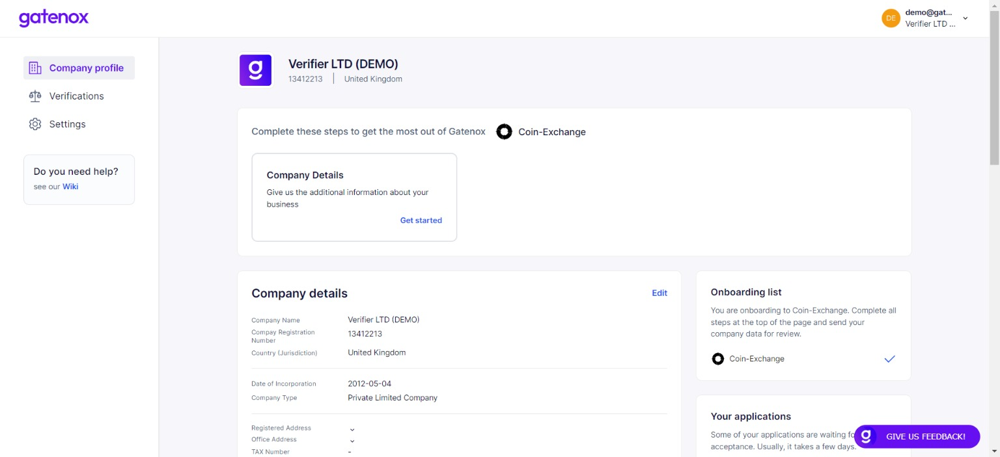

# Invitation for verification

### Why I received invitation?

If you have found an email from the Gatenox Hub, which invites you to onboarding process, it means that other Gatenox User has asked you to create and share your company corporate profile using Gatenox Hub.

<figure><figcaption>
Invitation for verification - email example
</figcaption></figure>

In the email you can find information about who invites you to onboarding process, including inviter webpage and email / support contact in case you have any questions about received invitation.

### What should I do?

If you recognized that inviter, there a few simple steps you need to do, to complete your company profile and share it with inviter.

1. If you already have an account on the Gatenox Hub, simple accept the invitation and you will be redirected to login page of the Gatenox Hub. After login you will automatically start the onboarding process - the inviter will be added to your current onboarding list, as described here: [share-your-profile](../../gatenox-guide/share-your-profile/ "mention").
2. If you do not have a Gatenox Hub account, after accepting invitation you will be redirected to login / sign-up page, where the account can be created. After creating the account, the onboarding process with inviter will start automatically - the inviter will be added to your current onboarding list.

In both cases, the amount of information required to be completed depends on the inviter / partner.

Sometimes, when you have already onboard to other company, your profile may include all required information and all you need to do is to press "Send for review" button.

<figure><figcaption></figcaption></figure>

Sometimes, only 1-2 additional fields are required. You will see appropriate notification on your profile.

<figure><figcaption></figcaption></figure>

If you have just created Gatenox account, then you will need to create the profile from scratch. Do not worry - we will facilitate the process for you! After providing company number and jurisdiction we will try to complete your profile with available data from the company register and other data sources. At the beginning you will see the company add screen. Learn more about creating your profile here: [create-new-company](../../gatenox-guide/user-journey/create-new-company/ "mention").

<figure><figcaption></figcaption></figure>