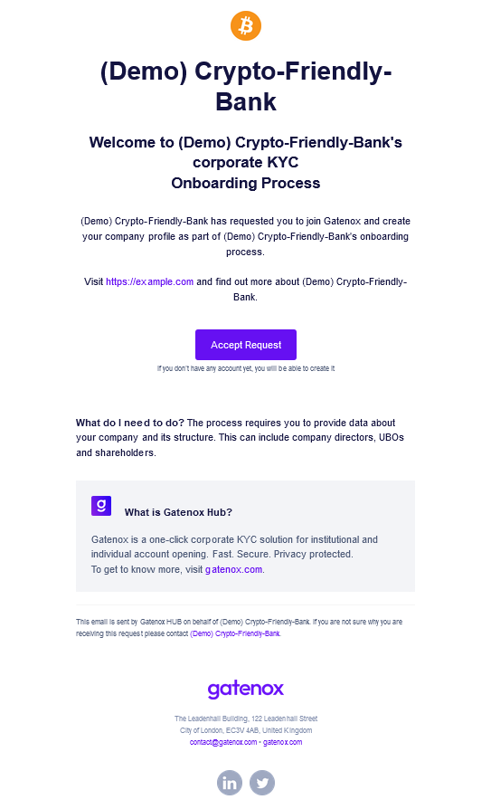
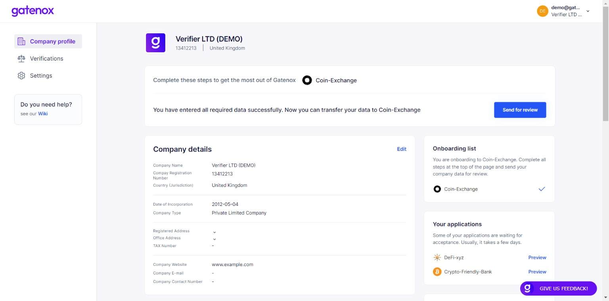

# Invitation for verification

### Why did I receive an invitation?

If you received an email from the Gatenox Hub inviting you to the onboarding process, it means that another Gatenox User has asked you to create and share your company corporate profile using Gatenox Hub.

<figure><figcaption>
Email - invitation for verification
</figcaption></figure>

In the email, you can find information about who invited you to the onboarding process including their webpage and email / support contact in case you have any questions about the received invitation.

### What should I do?

If you recognize the inviter, there are a few simple steps you need to do to complete your company profile and share it with the inviter.

1. If you already have an account on the Gatenox Hub, simply accept the invitation and you will be redirected to the login page of the Gatenox Hub. After login you will automatically start the onboarding process. The inviter will be added to your current onboarding list, as described here: [share-your-profile](../../gatenox-guide/share-your-profile/ "mention").
2. If you do not have a Gatenox Hub account, after accepting the invitation you will be redirected to the login / sign-up page where your account can be created. After creating the account, the onboarding process with inviter will start automatically with the inviter being added to your current onboarding list.

In both cases, the amount of information required to be completed depends on the inviter / partner.

* Sometimes, when you have already onboarded to another company, your profile may include all required information and all you need to do is to press the "Send for review" button. Learn more here: [share-my-profile.md](../share-company-profile/share-my-profile.md "mention").

<figure><figcaption>
Current onboarding - all required data provided
</figcaption></figure>

* Sometimes, only 1-2 additional fields are required. You will see the appropriate notifications on your profile. Learn more here: [complete-required-company-data.md](../share-company-profile/complete-required-company-data.md "mention").

<figure><figcaption>
Current onboarding - some required data is missing
</figcaption></figure>

* If you have just created a Gatenox account, you will need to create the profile from scratch. Do not worry - we will try to facilitate the process for you! After providing company number and jurisdiction we will try to complete your profile with any available data from the company register and other data sources. At the beginning you will see the company add screen. Learn more about creating your profile here: [add-new-company.md](../create-and-complete-company-profile/add-new-company.md "mention").

<figure><figcaption>
Add new company
</figcaption></figure>
