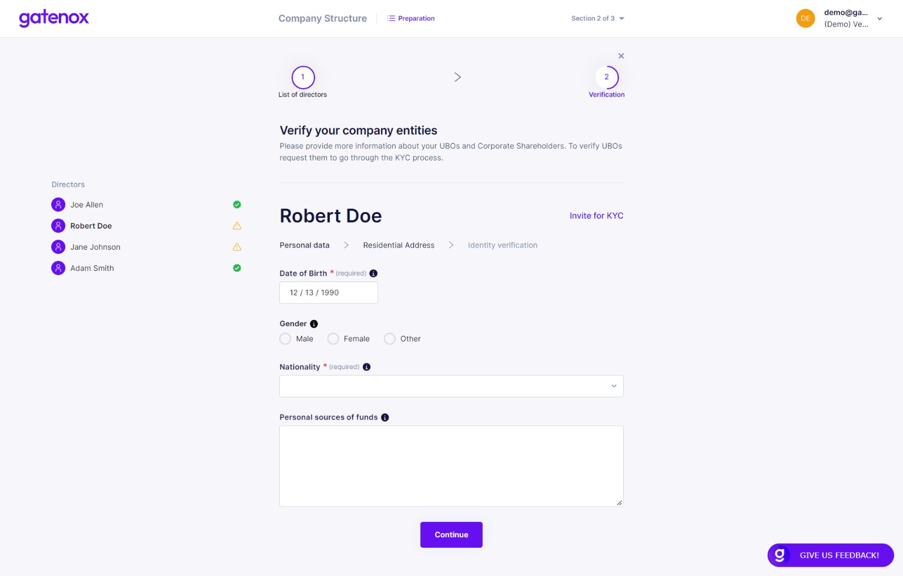

# Complete KYC details

If you owns individual identity data, the quickest way to complete the profile, is to add it on your own. Below you can find an example of completing individual data based on director role example. The same screens will be presented in case of individual shareholder or UBO.

:warning: Please bear in mind that required fields are marked with (\*) and "required" label. Depends on where you are currently onboarding ([share-my-profile.md](../share-company-profile/share-my-profile.md "mention")) different data may be required. On the left side of the screen you will see a list of directors / shareholders / UBOs. You can switch between their names. If the individual name is followed by a green "OK" icon then all required information has been provided.&#x20;

### Personal information

The first step is to provide personal information. Click on the "Continue" button after completing all required information to move to the next step.

<figure><figcaption>
Individual KYC - personal data
</figcaption></figure>

Now you can provide the individuals's residential address - pick one from the list or enter a new one manually. Click on the "Continue" button after completing all required information to move to the next step.

<figure><figcaption>
Individual KYC - residential address
</figcaption></figure>

In this step you are asked to provide the individual's identity document. Pick one of the following identity document types: passport, national ID card or driving license. After choosing the type, enter documents data (country of issue / citizenship, number, issue and expiry date) and upload document photo.

<figure><figcaption>
Directors - identity document
</figcaption></figure>

