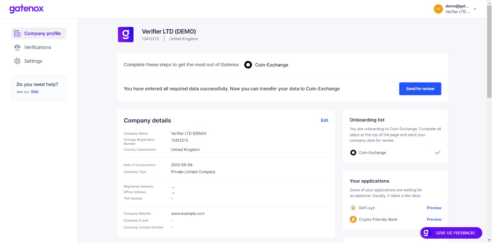
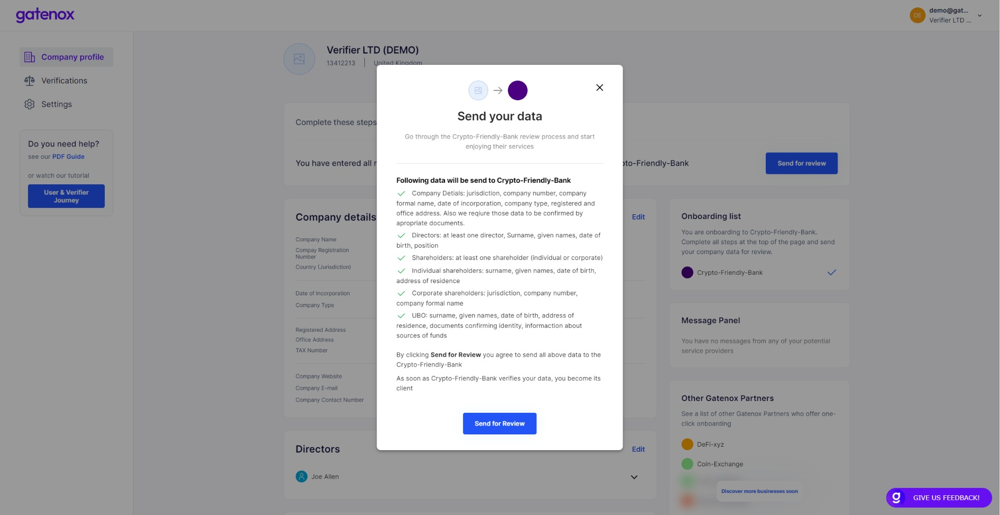

# Share my profile

If you have all data required by Gatenox Partner in your company profile, the proper notification will be displayed on the top of the screen.

<figure><figcaption>
Current onboarding - all required data entered 
</figcaption></figure>

In this case you are just a few clicks from sharing your profile. Press the "Send to review" button in the notification section of the screen.

<figure><figcaption>
Share my profile - send data to Partner
</figcaption></figure>

This is the final step. The summary of shared data is presented. Now you can just click on the "Send for review" button and your profile has been shared with Partner!
