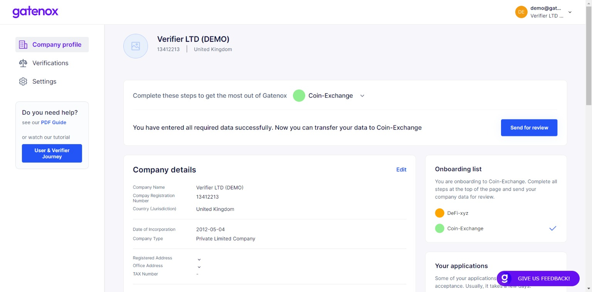

# Start onboarding

You can add a service provider (also called as "Gatenox Partners") in two ways.

The service provider, which allow business users to send company profile (documents and data) using Gatenox have 2 methods to invite business users to apply using Gatenox Hub:

1. The Partner can send you an invitation email with the link. More information about invitation email can be found here: [invitation-for-verification.md](../i-received-email-from-gatenox/invitation-for-verification.md "mention").
2. The Partner can implement a button on the service webpage.

<figure><figcaption>
"Apply via Gatenox" button
</figcaption></figure>

In both cases after clicking on the link, you will be redirected to the Gatenox Hub login / sign up page and after the successful login / sign up, the partner's name will be added to your "Onboarding list". Your "Onboarding list" is presented on the right side of the "You company profile" screen.

<figure><figcaption>
Onboarding list
</figcaption></figure>

Depending on your actual profile completeness level, there are 2 situations, which may occur:

1. Your profile has all data required by Partner - in this case, you can automatically send data to Partner. This situation usually happens during second or later onboarding, when most of the data has been already entered. Learn more here: [share-my-profile.md](share-my-profile.md "mention").
2. Your profile requires additional information - in this case, you are asked to complete your company profile. This situation usually happens after a new account was created or during the first onboarding. Do not worry - we are here to guide you through the process. Let's move on to: [complete-required-company-data.md](complete-required-company-data.md "mention").&#x20;
