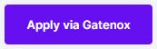

# Apply via Gatenox

Instead of sending each user an invitation email ([send-invitation-for-review.md](send-invitation-for-review.md "mention")), you can add "Apply via Gatenox" button or link on your webpage / portal using your referral code ([referral-code.md](referral-code.md "mention")).

You can use the following button to inform users about verification processes via Gatenox:

<figure><figcaption>Apply via Gatenox button</figcaption></figure>



```
<a class="GatenoxButton" href="<gatenoxUrl>">
	</img>
	<div class="GatenoxButton-caption">Apply via Gatenox</div>
</a>
```

The "\<gatenoxUrl>" variable should be replaced with your referral code (including link to Gatenox Hub). It is available to copy from "Settings" menu, tab "Company account" ([#where-is-my-referral-code](referral-code.md#where-is-my-referral-code "mention")).



```
.GatenoxButton {
  margin: 0 auto;
  display: block;
  position: relative;

  height: 50px;
  width: 286px;
  border-radius: 10px;
  background-color: #6610F2;
  box-shadow: 0 5px 10px -5px rgba(0,0,0,0.2);
}

.GatenoxButton-logo {
  display: block;
  width: 30px;
  height: 30px;
  position: absolute;
  top: 9px;
  left: 16px;
}

.GatenoxButton-caption {
  position: absolute;
  top: 9px;
  left: 62px;

  height: 30px;
  width: 224px;
  color: #FFFFFF;
  font-family: Inter;
  font-size: 24px;
  line-height: 30px;
  font-weight: 100;
  text-align: center;

}
```


