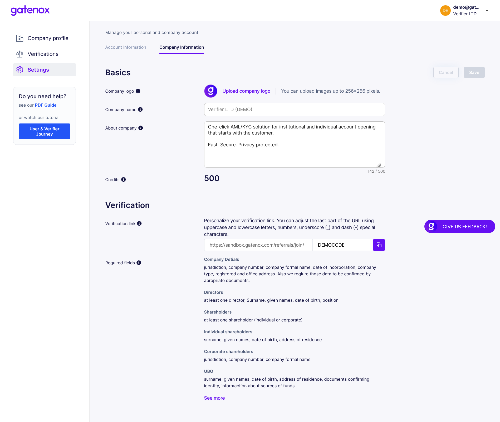

# Referral code

Each verifier receives dedicated referral code which is used to quickly redirect customer to Gatenox and start onboarding process.

### Where is my referral code?

The referral code is generated automatically after new company is created. It can be found in "Settings" menu on "Company account" tab.

<figure><figcaption></figcaption></figure>

At the beginning the code consist of randomly generated letters and digits. If you prefer you can change the code to better fit your requirements, for example: company name.

### Where referral code is used?

The referral code (with link to Gatenox Hub) is used in:

1. invitation emails ([send-invitation-for-review.md](send-invitation-for-review.md "mention"))
2. "Apply via Gatenox" button or link ([apply-via-gatenox-button.md](apply-via-gatenox-button.md "mention"))
