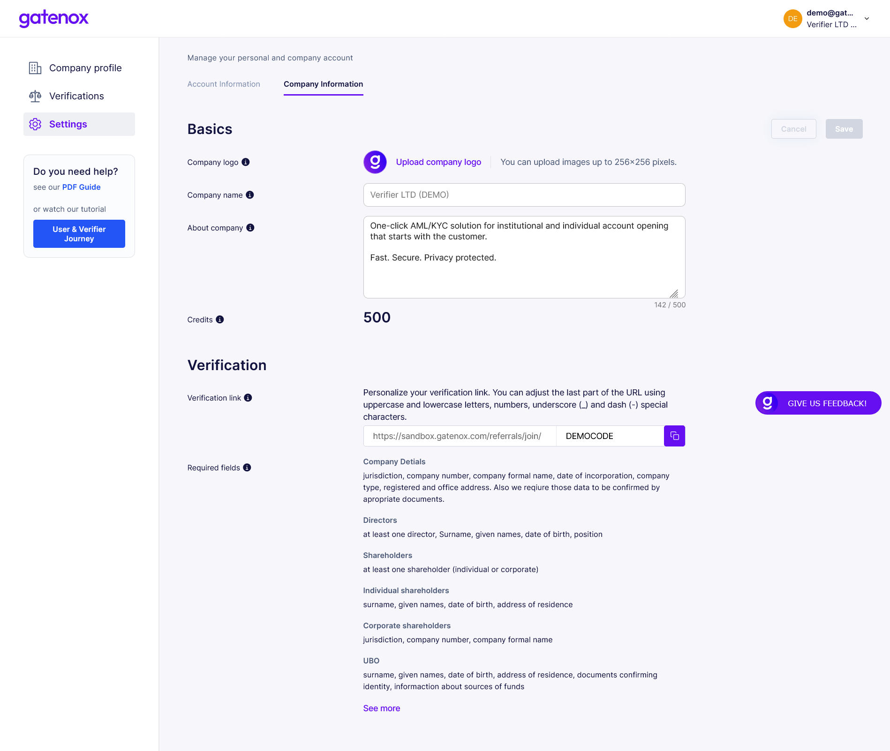
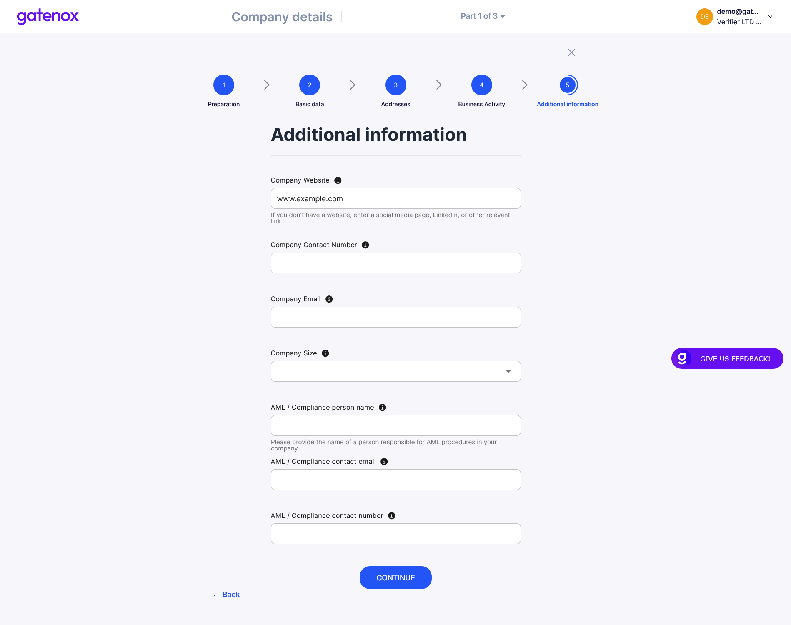

# About your company

### Set company logo

Your logo is your visual identity. We will use your logo throughout the Gatenox Platform. You can add the logo in the "Settings" menu, under the "Company information" tab.

<figure><figcaption>
Settings - company information
</figcaption></figure>

### Describe your services

Your services description will be used in invitation emails sent via Gatenox to your customers. Your can shortly describe your business in the "Settings" menu, under the "Company information" tab.

### Add you webpage address

Your webpage address will be used in invitation emails send via Gatenox to your customers. We treat this data as a part of your corporate profile, that is why you can add it in "Company profile" menu, by editing "Company details". Please navigate to "Additional information" and fill "Company website" field.

<figure><figcaption>
Company details - additional information
</figcaption></figure>
